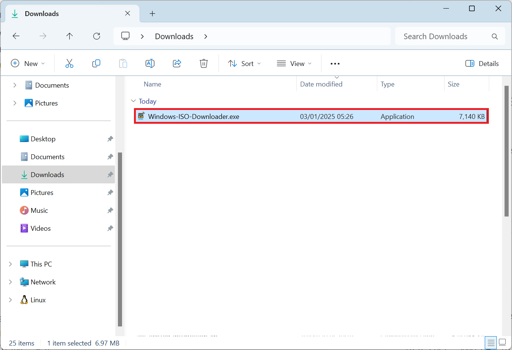
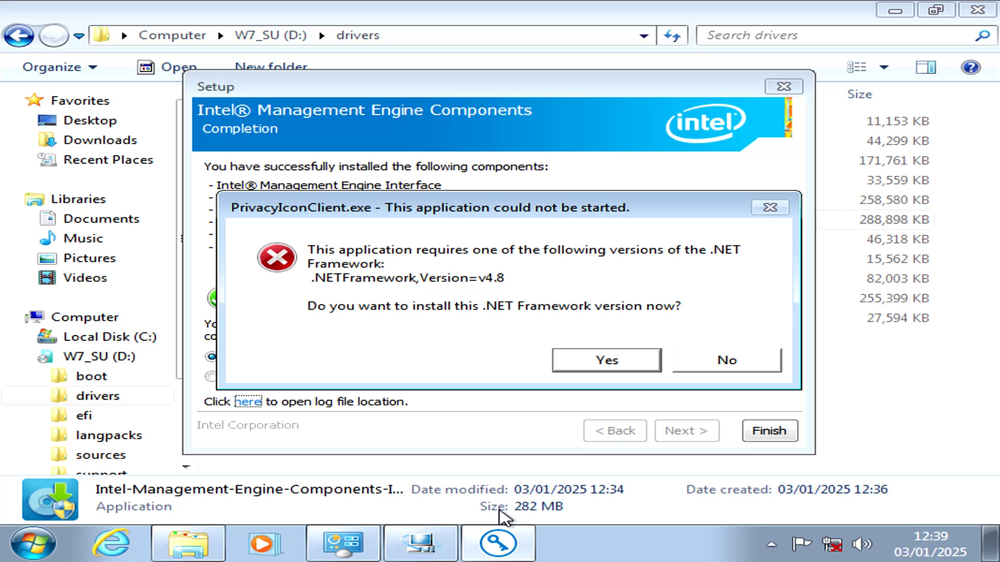
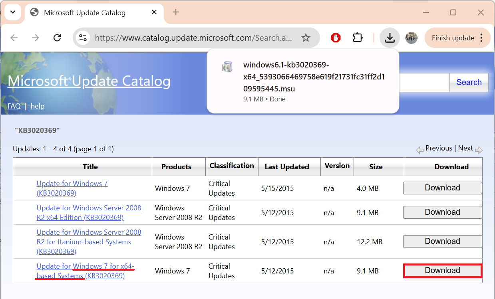
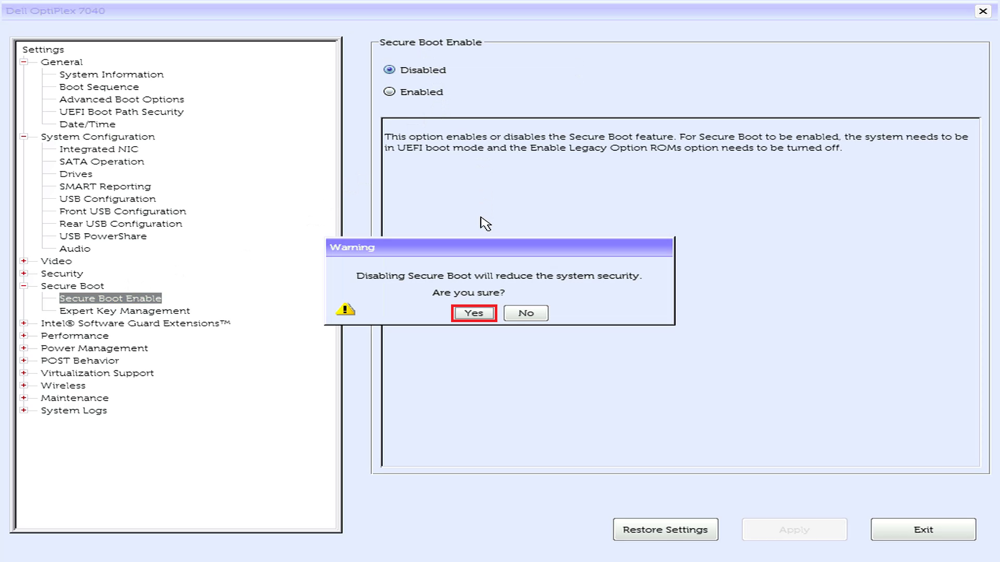
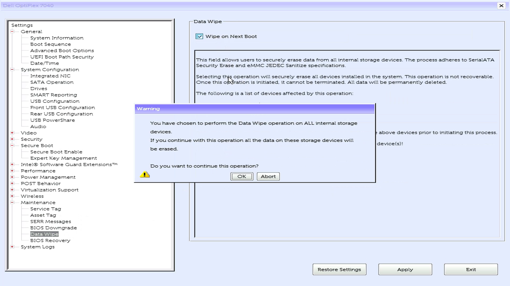
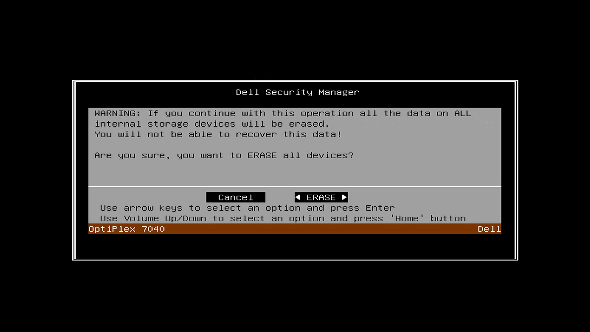
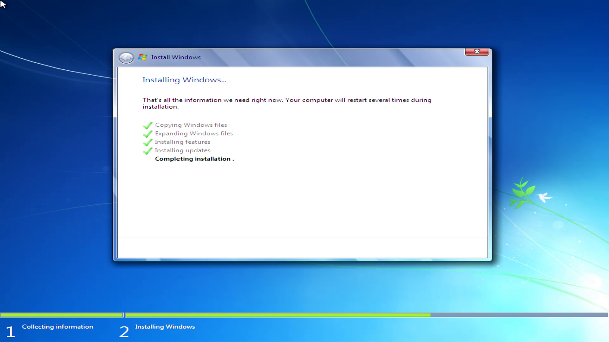

# Windows 7 Installation Guide

This guide covers installation of Windows 7 OEM on a device with an OEM license including downgrade rights to Windows 7 Professional. This guide is Dell-based but should equally apply to systems from major OEMs such as Lenovo and HP. This guide was originally on WordPress however I rewrote it on GitHub because I surprisingly got a lot of requests for this guide when I discontinued my WordPress subscription.

## End of Life

Windows 7 Reached End of Life 5 years ago in April 2020 and should be deemed insecure. **Use with caution.**

## Firmware Technologies

Power up your Device and press `F2` (Dell Devices) to enter the BIOS/UEFI Setup. The function key combination may differ for other manufacturers. Check with your device manufacturer for the correct function key combination to enter the BIOS/UEFI setup:


At the top is the system model, date of manufacture and BIOS Version:


The BIOS Version should match the final version available for your model.

Additional details such as the Processor, installed memory, video controller and wireless card should display:


The menu to the left hand side displays an option that says UEFI and an option that says Secure Boot. These options need to be configured for a Windows 7 installation.

Windows 7 was released in September 2009 when the motherboard firmware used the Basic Input Output System (BIOS) which is now known as a Legacy BIOS. Unified Extensive Firmware Interface (UEFI) was an improvement to BIOS and was developed in 2011 shipping with some business models before it became the standard in 2012.

Intel only provided Windows 7 drivers for motherboards that use 1st-6th generation processors. In the case of the OptiPlex 7050, the motherboards socket supports 6th generation processors and 7th generation processors. As the motherboard is supported for Windows 7 and the 7th generation processor uses the same motherboard drivers, this configuration will work. This may not be the case for motherboards which only support 7th generation processors.

For reference:

|Model|Release Date|Processor|SLIC|Technologies|
|---|---|---|---|---|
|~~OptiPlex 755~~|2008|Intel Core 2 Duo|~~2.0~~|Legacy BIOS|
|OptiPlex 760|2009|Pentium|2.1|Legacy BIOS|
|OptiPlex 780|2010|Core 2 Quad|2.1|Legacy BIOS|
|OptiPlex 390/790|2011|2nd Generation (Sandy Bridge)|2.1|UEFI BIOS – No Secure Boot, there is no option for Legacy ROMs as these are always Enabled|
|OptiPlex 3010/7010|2012|3rd Generation (Ivy Bridge)|2.1|UEFI BIOS with Secure Boot (only with the latest UEFI BIOS Update)|
|OptiPlex 7020|2014|4th Generation (Haswell)|2.1|UEFI BIOS with Secure Boot|
|OptiPlex 7040|2015|6th Generation (Skylake)|2.1|UEFI BIOS with Secure Boot|
|OptiPlex 7050|2017|6th Generation (Skylake) or 7th Generation (Kabylake)|2.1|UEFI BIOS with Secure Boot|
|~~OptiPlex 7060~~|2018|~~8th generation (Coffeelake)~~|2.1|UEFI BIOS with Secure Boot|

## OEM Product Activation (OEM CoA, OEM SLP and OEM SLIC)

Windows 7 had a number of product activation mechanisms. 

The key on the Code of Authenticity (CoA) was typically only used for Retail Product Activation. On devices shipped with Windows 7. The CoAs provided to OEMS were often of low print and prone to fading so were later placed in the battery compartments of laptops or hatches to reduce exposure:


The product key on the CoA was typically never used for OEM Product Activation and use of this product key with retail installation media required phone activation. 

Instead of a unique product key, offline device firmware based product activation was used. OEM Installation media automatically inputs a generic OEM System Locked Preinstallation (SLP) key and Windows 7 automatically activates offline with the SLP key. This automatic product activation only takes place when the motherboard has a compatible System License Internal Code (SLIC) embedded in the devices firmware:

|Firmware|OS|Downgrade Rights|
|---|---|---|
|SLIC 1|Windows XP||
|SLIC 2.0|Windows Vista|Windows XP Professional|
|SLIC 2.1|Windows 7|Windows Vista Business + Windows XP Professional|
|MSDM + SLIC 2.1|Windows 8 Professional|Windows 7 Professional|
|MSDM + SLIC 2.1|Windows 8.1 Professional|Windows 7 Professional|
|MSDM + SLIC 2.1|Windows 10 Professional|Windows 7 Professional|

Devices shipped approximately half a year before the release of Windows 7 were eligible for a free upgrade and had a BIOS update which updated the SLIC from 2.0 to 2.1.

OEM SLP is the only activation mechanism available for devices that use OEM Downgrade rights from Windows 8 Professional or Windows 10 Professional to Windows 7 Professional.

## Download Windows 7

The [Windows ISO Download Tool](https://www.heidoc.net/joomla/technology-science/microsoft/67-microsoft-windows-and-office-iso-download-tool) can be used to list Windows ISO Downloads.



Windows 7 reached end of life in January 2020 and Microsoft have removed most Windows 7 related downloads... 


However OEMs like Dell retain their legacy downloads. Although the ISO listed appear to be model specific, they are generic and do not have a model specific driver pack slipstreamed. Select OptiPlex 7040 and select Windows 7 Professional 64 Bit or Windows 7 Professional 32 Bit:


Then select Download:


Although this ISO says Windows 7 Professional, it is a multi-edition and multi-lingual ISO containing:

* Windows 7 Starter* (2011)
* Windows 7 Home Basic (2011)
* Windows 7 Home Premium (2011)
* Windows 7 Professional (2016**)
* Windows 7 Ultimate (2011)

\* 32 Bit only.

\*\* The Windows 7 Professional index of the install.wim was slipstreamed to include USB 3.0 drivers and NVMe drivers giving support for 6th Generation Intel (Skylake) Processors. Internet Explorer 11 was slipstreamed alongside a large number of security updates. 

Minor changes can be made using a text editor to switch edition, OEM or channel once the Bootable USB has been created.

## Creating a Bootable USB with Rufus

The last version of Rufus to support Windows 7 is version 3.22. Rufus can be downloaded from the official website [Rufus](https://rufus.ie/downloads/). Launch Rufus:


Select select:


Select the Windows 7 ISO and select Open:


Select check ISO checksums:


The SHA256:


Should match the SHA256 listed on the Windows ISO Download Tool, if it does not the ISO is corrupt:


If the computer supports UEFI and Windows 7 64 Bit is being used, the Partition Scheme should be GPT and the target system UEFI:


If the computer has a Legacy BIOS or Windows 7 32 Bit is being used, the Partition Scheme should be MBR and the target system BIOS:


Select Start:


Select OK:


When finished, Rufus will say Ready, select Close:


## Selecting Windows 7 Edition or OEM

The default edition is Windows 7 Professional and Dell OEM SLP is applied by default. Skip this step if these defaults match your system.

<details>
<summary>Changing Edition or OEM</summary>

Examine the Bootable USB in Windows Explorer. Navigate to the `sources` folder:


Select the ei.cfg file and open it in notepad:


For an OEM license change professional to the desired edition:


For a Retail license, delete the `ei.cfg` file.

<details>
<summary>Windows 7 Starter</summary>

```
[EditionID]
starter
[Channel]
OEM
[VL]
0
```

</details>

<details>
<summary>Windows 7 Home Basic</summary>

```text
[EditionID]
homebasic
[Channel]
OEM
[VL]
0
```

</details>

<details>
<summary>Windows 7 Home Premium</summary>

```text
[EditionID]
homepremium
[Channel]
OEM
[VL]
0
```

</details>

<details>
<summary>Windows 7 Professional</summary>

```text
[EditionID]
professional
[Channel]
OEM
[VL]
0
```

</details>

<details>
<summary>Windows 7 Ultimate</summary>

```text
[EditionID]
ultimate
[Channel]
OEM
[VL]
0
```

</details>

Navigate to the `sources` folder:


To change from an OEM channel to Retail channel, delete the `$OEM$` folder. To change edition or OEM navigate to `sources\$OEM$\$$\setup\scripts`:


Open up the `slp.cmd` in notepad:


This script applies the Windows 7 OEM Microsoft Security Certificate file and generic OEM System Locked Preinstallation Key which is OEM and Edition specific:


Update this key in accordance to the OEM and the Edition:

<details>
<summary>Dell</summary>

|Edition|SLP Key|
|---|---|
|Starter|36T88-RT7C6-R38TQ-RV8M9-WWTCY|
|Home Basic|36Q3Y-BBT84-MGJ3H-FT7VD-FG72J|
|Home Premium|6RBBT-F8VPQ-QCPVQ-KHRB8-RMV82|
|Professional|32KD2-K9CTF-M3DJT-4J3WC-733WD|
|Ultimate|342DG-6YJR8-X92GV-V7DCV-P4K27|

</details>

<details>
<summary>Lenovo/IBM</summary>

|Edition|SLP Key|
|---|---|
|Starter|273P4-GQ8V6-97YYM-9YTHF-DC2VP|
|Home Basic|22MFQ-HDH7V-RBV79-QMVK9-PTMXQ|
|Home Premium|27GBM-Y4QQC-JKHXW-D9W83-FJQKD|
|Professional|237XB-GDJ7B-MV8MH-98QJM-24367|
|Ultimate|6K2KY-BFH24-PJW6W-9GK29-TMPWP|

</details>

<details>
<summary>HP/Compaq</summary>

|Edition|SLP Key|
|---|---|
|Starter|DX8R9-BVCGB-PPKRR-8J7T4-TJHTH|
|Home Basic|MHFPT-8C8M2-V9488-FGM44-2C9T3|
|Home Premium|4FG99-BC3HD-73CQT-WMF7J-3Q6C9|
|Professional|74T2M-DKDBC-788W3-H689G-6P6GT|
|Ultimate|MHFPT-8C8M2-V9488-FGM44-2C9T3|

</details>

<details>
<summary>Acer, Gateway and Packard</summary>

|Edition|SLP Key|
|---|---|
|Starter|RDJXR-3M32B-FJT32-QMPGB-GCFF6|
|Home Basic|MB4HF-2Q8V3-W88WR-K7287-2H4CP|
|Home Premium|VQB3X-Q3KP8-WJ2H8-R6B6D-7QJB7|
|Professional|YKHFT-KW986-GK4PY-FDWYH-7TP9F|
|Ultimate|FJGCP-4DFJD-GJY49-VJBQ7-HYRR2|

</details>

<details>
<summary>ASUS</summary>

|Edition|SLP Key|
|---|---|
|Starter|6K6WB-X73TD-KG794-FJYHG-YCJVG|
|Home Basic|89G97-VYHYT-Y6G8H-PJXV6-77GQM|
|Home Premium|2QDBX-9T8HR-2QWT6-HCQXJ-9YQTR|
|Professional|2WCJK-R8B4Y-CWRF2-TRJKB-PV9HW|
|Ultimate|2Y4WT-DHTBF-Q6MMK-KYK6X-VKM6G|

</details>

<details>
<summary>Sony</summary>

|Edition|SLP Key|
|---|---|
|Starter|32J2V-TGQCY-9QJXP-Q3FVT-X8BQ7|
|Home Basic|YV7QQ-RCXQ9-KTBHC-YX3FG-FKRW8|
|Home Premium|H4JWX-WHKWT-VGV87-C7XPK-CGKHQ|
|Professional|H9M26-6BXJP-XXFCY-7BR4V-24X8J |
|Ultimate|YJJYR-666KV-8T4YH-KM9TB-4PY2W|

</details>

<details>
<summary>Toshiba</summary>

|Edition|SLP Key|
|---|---|
|Starter|TGBKB-9KBGJ-3Y3J6-K8M2F-J2HJQ|
|Home Basic|9H4FH-VD69Y-TGBD2-4PM4K-DRMMH|
|Home Premium|6B88K-KCCWY-4F8HK-M4P73-W8DQG|
|Professional|2V8P2-QKJWM-4THM3-74PDB-4P2KH|

</details>

<details>
<summary>Samsung</summary>

|Edition|SLP Key|
|---|---|
|Starter|PV9BD-YBRX6-CTMG6-CCMJY-X8XG7|
|Home Basic|2P6PB-G7YVY-W46VJ-BXJ36-PGGTG|
|Home Premium|CQBVJ-9J697-PWB9R-4K7W4-2BT4J|
|Professional|GMJQF-JC7VC-76HMH-M4RKY-V4HX6|
|Ultimate|49PB6-6BJ6Y-KHGCQ-7DDY6-TF7CD|

</details>

<details>
<summary>MSI</summary>

|Edition|SLP Key|
|---|---|
|Starter|2W4DJ-JFFJV-DMCPP-2C3X8-883DP|
|Home Premium|4G3GR-J6JDJ-D96PV-T9B9D-M8X2Q|

</details>

Navigate to `sources\$OEM$\$$\system32\OEM`. The `ie.bat` file applies Dell OEM branding in Internet Explorer:


Open up this file in notepad:


Delete the content under `:defaults`


Navigate to `sources\$OEM$\$$\setup\scripts`. The `unattend.xml` applies Dell OEM branding in System Properties. 

Open this file in notepad and delete all the contents between the unattend xml header.


```html
<?xml version="1.0" encoding="utf-8" ?>
<unattend xmlns="urn:schemas-microsoft-com:unattend">
</unattend>
```


</details>

## Windows 7 Security Patches + .Net Framework

Many of the Intel system drivers require some Windows Updates to be installed in order for their respective installers to load:



The following standalone updates should be installed from Microsoft before installing system drivers:

**Select the "Windows 7 64 Bit" Package for Windows 7 64 Bit or and "Windows 7" package for Windows 7 32 Bit.**



Convenience Rollup:

* [Service Stack KB3020369](https://www.catalog.update.microsoft.com/Search.aspx?q=KB3020369)
* [Convenience Rollup KB3125574](https://www.catalog.update.microsoft.com/Search.aspx?q=3125574)

Note that a restart is required after installing these updates:

<details>
<summary>IE11</summary>
IE11 is slipstreamed in the Pro Edition of the Dell Skylake ISO. For other editions, the following should be installed:

IE11 Prerequisite Updates:

* [KB2729094](https://www.catalog.update.microsoft.com/Search.aspx?q=2729094)
* [KB2670838](https://www.catalog.update.microsoft.com/Search.aspx?q=2670838)
* [KB2834140](https://www.catalog.update.microsoft.com/Search.aspx?q=2834140)
* [KB3020369](https://www.catalog.update.microsoft.com/Search.aspx?q=3020369)

IE11:

* [IE11 64 Bit](https://www.microsoft.com/en-us/download/details.aspx?id=41628)
* [IE11 32 Bit](https://www.microsoft.com/en-us/download/details.aspx?id=40907)

A restart is required after installing these updates.

</details>

Service Stack Updates for January 2020 Rollup:

* [KB4474419](https://www.catalog.update.microsoft.com/Search.aspx?q=4474419)
* [KB4490628](https://www.catalog.update.microsoft.com/Search.aspx?q=4490628)
* [KB4536952](https://www.catalog.update.microsoft.com/Search.aspx?q=4536952)

Security Rollup:

**Windows 7 Reached End of Life in January 2020 so this is the final Security Rollup.**

* [Security Rollup KB4534310](https://www.catalog.update.microsoft.com/Search.aspx?q=2020-01%20Security%20Monthly%20Quality%20Rollup)

A restart is required after installing these updates. 

Microsoft .Net Framework: 

* [Microsoft .NET 4.7.2 Framework (Offline Installer)](https://support.microsoft.com/en-gb/topic/microsoft-net-framework-4-7-2-offline-installer-for-windows-05a72734-2127-a15d-50cf-daf56d5faec2)
* [Microsoft .NET 4.8.0 Framework (Offline Installer)](https://support.microsoft.com/en-gb/topic/microsoft-net-framework-4-8-offline-installer-for-windows-9d23f658-3b97-68ab-d013-aa3c3e7495e0)

Create a new folder on the Bootable USB called `drivers`:


Create a subfolder called `os updates`:


Copy the above downloads to it:


## Drivers and Downloads

The Device Drivers will need to be manually downloaded from the OEMs drivers and downloads page: 

* [Dell Drivers and Downloads](https://www.dell.com/support/home/en-us?app=drivers) 
* [Lenovo Drivers and Downloads](https://support.lenovo.com/gb/en) 
* [HP Drivers and Downloads](https://support.hp.com/gb-en/drivers)

Select the system model:


Windows 7 usually doesn't have any network drivers preinstalled so these tools cannot connect to the internet in any case. Select expand (if this does not show select Check for Updates and then cancel the prompt to install SupportAssist):


Select Windows 7 64 Bit or Windows 7 32 Bit under Operating System:


Under category select chipset


Create the subfolders

chipset:

* Intel Chipset
* Intel USB Host Controller
* Intel Management Engine Interface
* Realtek Memory Card Reader


storage:

* Intel Rapid Storage Technology


audio:

* Realtek Audio


video:

Dell systems typically have variations in the video card. Details about the video card is shown in the system information page in the BIOS Setup


* Intel Video
* NVIDIA or AMD Video\*

\* When using switchable graphics, the Intel driver should be installed first before the NVIDIA or AMD video driver. This system only has Intel graphics. 


network:

Dell systems typically have variations in the wireless card. Details about the wireless card is shown in the system information page in the BIOS Setup


**Windows 7 is at end of life and should be deemed insecure, use offline or apply caution when connected to the internet.**

* Ethernet
* Wireless
* Bluetooth


applications:

For Windows 7, Dell usually provided utilities for managing function keys and power settings:

* Dell Quickset

This is not applicable for this desktop. 

The installation media is now ready:


## BIOS Setup

Power up your Device and press `F2` (Dell Devices) to enter the BIOS/UEFI Setup. The function key combination may differ for other manufacturers. Check with your device manufacturer for the correct function key combination to enter the BIOS/UEFI setup:


The System Information will display:


Navigate to System Configuration and then to SATA Operation and change the setting to RAID:


Navigate to Secure Boot then to Secure Boot Enable and change the setting to Disabled:

**Windows 7 does not support Secure Boot and does not pass Secure Boot**.


Select Yes:



**Legacy Option ROMs must be enabled for Windows 7.**.

Navigate to Advanced Boot Options and select Enable Legacy Option ROMS. Enable Attempt Legacy Boot should be DIsabled:


Navigate to Boot Sequence:


Uncheck the UEFI: USB and select Delete to delete old boot entries:


Now only the Bootable USB Displays:


In the maintainance tab, select data wipe:

**Earlier Dell Models do not have the Data Wipe feature.**

Select Wipe on next Boot:


Select OK:



Select No:


Select Exit to exit the Setup:


Select OK:


The device will reboot:


Showing the Dell logo:


The Data Wipe prompt will display select Continue:


Select Erase:



**Data wipe will take a couple of minutes for a SSD and several hours for a HDD.**

Select OK:


## Booting from USB

Insert the Bootable USB. Power up the Dell and press `F12`:


Select the Bootable USB under the UEFI Boot option (unless Windows 7 32 Bit):


The Windows Setup will load files:


The Starting Windows logo will display:


Select your Language:


Select your regional settings:


Select Next:


Select Install Now:


The setup will start and the edition and product key will be input from the installation media:


Accept the License Agreement and select Next:


## Drive Options

Select Custom Install:


If the system has been wiped the internal drives looks as follows:


If an old installation is present, old partitions may be present and need to be removed:

<details>
<summary>Removing Partitions from an old installation</summary>

Select Drive Options (Advanced):


Select each partition in turn and select Delete:


Select OK at the prompt:


Select the next partition and select delete:


Select OK:


Select OK:


Select the next partition and select delete:


Select OK:


</details>

Select Disk 0 Unallocated Space and select Next: 


## Windows Setup

The Windows Setup will copy files to the Boot Drive and expand the files:


Then prompt for a restart. At this stage remove the Bootable USB:


The Windows Setup will continue from the internal drive once the computer restarts:




The Windows setup will restart again:


## User Account Setup

Input your name and computer name:


Optionally input a password:


The update options are redundant as Windows 7 has reached end of life:


Select your time zone and select next:


The setup will finish taking you to the Windows 7 Desktop:


## System Drivers

System drivers and a generic display driver is used:


Install the OS Updates and then the system drivers in the order listed previously:


## Product Activation

Left click the Start Button and Right Click Computer and select Properties:


Windows is activated and the Product ID contains "OEM-899" meaning OEM SLP is used. The Product ID will differ for each Edition and OEM:


A check can also be made in the Device Manager:


All the system drivers are installed and no errors are present:


