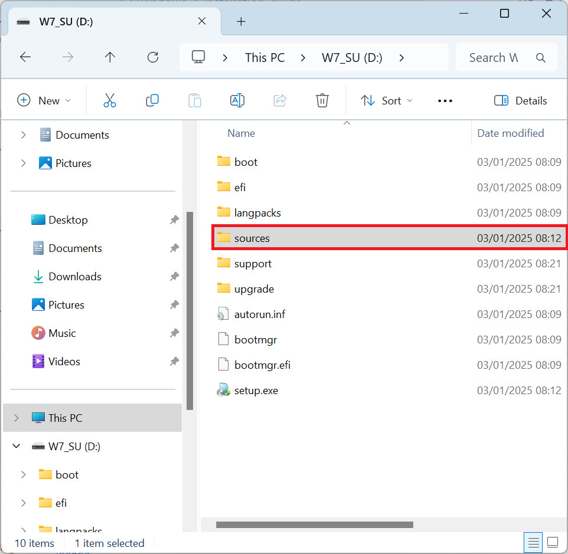
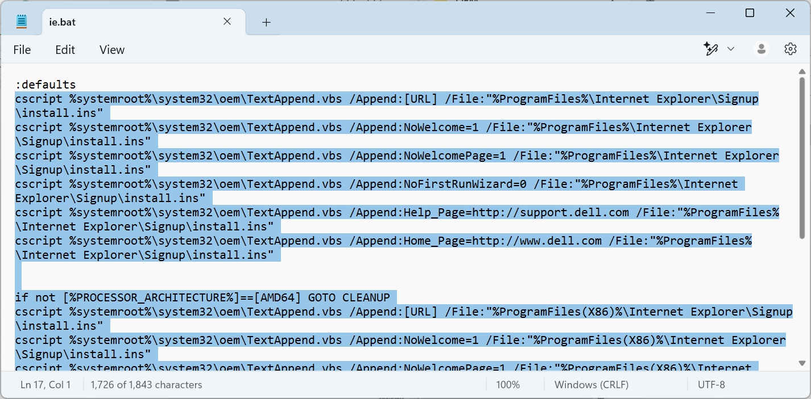
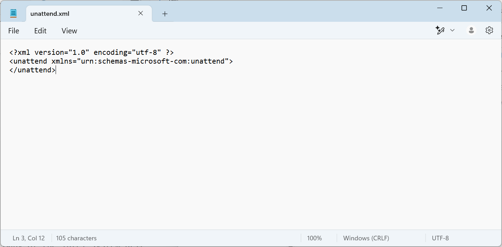
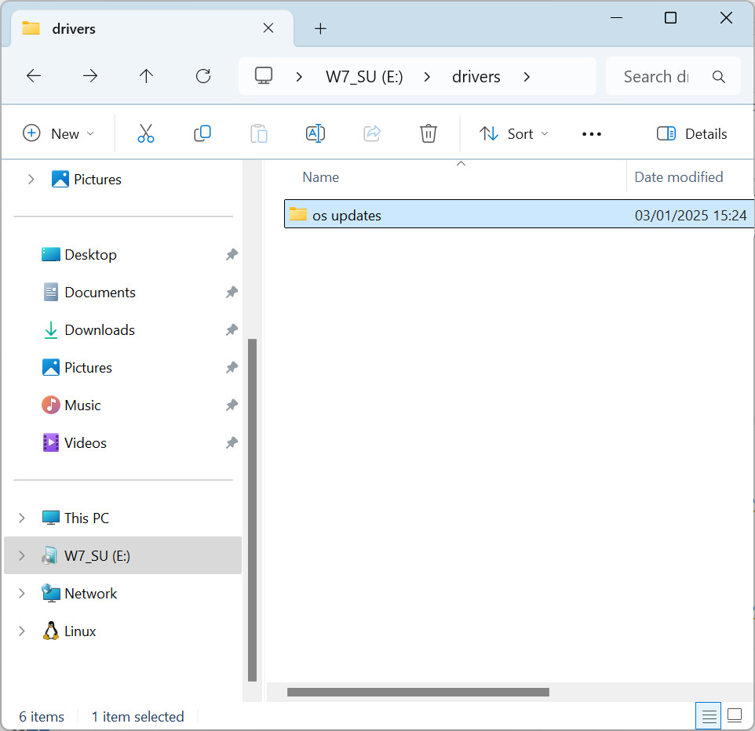
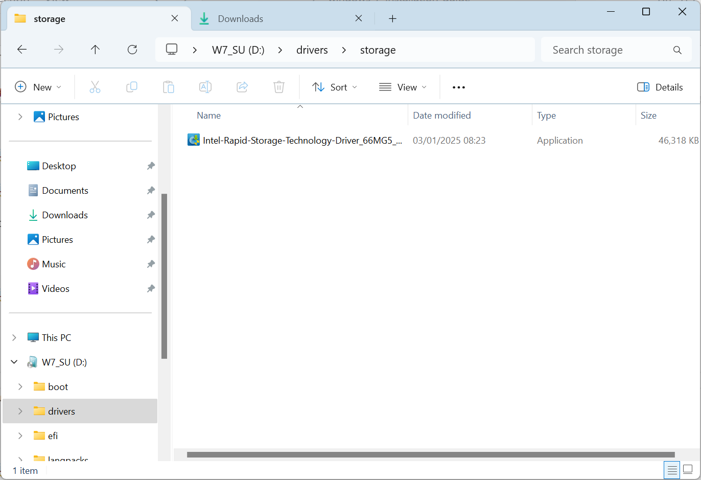
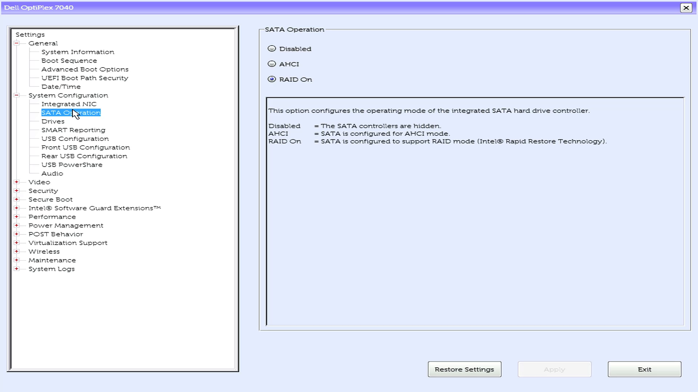
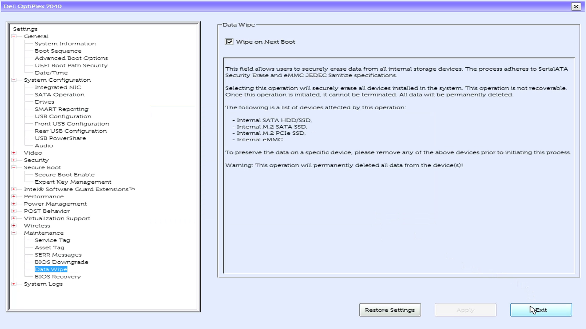

# Windows 7 Installation Guide

## End of Life

Windows 7 Reached End of Life in April 2020 and should be deemed insecure.

## Firmware Technologies

Power up your Dell and press `F2` to enter the BIOS/UEFI Setup. Check with your device manufacturer for the correct function key combination to enter the BIOS/UEFI setup:


At the top is the system model, date of manufacture and BIOS Version:


The BIOS Version should match the final version available for your model.

Additional details such as the Processor, installed memory, video controller and wireless card should display:


The menu to the left hand side displays an option that says UEFI and an option that says Secure Boot. These options need to be configured for a Windows 7 installation.

Windows 7 was released in September 2009 when the motherboard firmware used the Basic Input Output System (BIOS) which is now known as a Legacy BIOS. Unified Extensive Firmware Interface (UEFI) was an improvement to BIOS and was developed in 2011 shipping with some business models before it became the standard in 2012.

Intel only provided Windows 7 drivers for motherboards that use 1st-6th generation processors. In the case of the OptiPlex 7050, the motherboards socket supports 6th generation processors and 7th generation processors. As the motherboard is supported for Windows 7 and the 7th generation processor uses the same motherboard drivers, this configuration will work. This may not be the case for motherboards which only support 7th generation processors.

For reference:

|Model|Release Date|Processor|SLIC|Technologies|
|---|---|---|---|---|
|~~OptiPlex 755~~|2008|Intel Core 2 Duo|~~2.0~~|Legacy BIOS|
|OptiPlex 760|2009|Pentium|2.1|Legacy BIOS|
|OptiPlex 780|2010|Core 2 Quad|2.1|Legacy BIOS|
|OptiPlex 390/790|2011|2nd Generation (Sandy Bridge)|2.1|UEFI BIOS – No Secure Boot, there is no option for Legacy ROMs as these are always Enabled|
|OptiPlex 3010/7010|2012|3rd Generation (Ivy Bridge)|2.1|UEFI BIOS with Secure Boot (only with the latest UEFI BIOS Update)|
|OptiPlex 7020|2014|4th Generation (Haswell)|2.1|UEFI BIOS with Secure Boot|
|OptiPlex 7040|2015|6th Generation (Skylake)|2.1|UEFI BIOS with Secure Boot|
|OptiPlex 7050|2017|6th Generation (Skylake) or 7th Generation (Kabylake)|2.1|UEFI BIOS with Secure Boot|
|~~OptiPlex 7060~~|2018|~~8th generation (Coffeelake)~~|2.1|UEFI BIOS with Secure Boot|

## OEM Product Activation (OEM CoA, OEM SLP and OEM SLIC)

Windows 7 had a number of product activation mechanisms. 

The key on the Code of Authenticity (CoA) was typically only used for Retail Product Activation. On devices shipped with Windows 7. The CoAs provided to OEMS were often of low print and prone to fading so were later placed in the battery compartments of laptops or hatches to reduce exposure:


The product key on the CoA was typically never used for OEM Product Activation and use of this product key with retail installation media required phone activation. 

Instead of a unique product key, offline device firmware based product activation was used. OEM Installation media automatically inputs a generic OEM System Locked Preinstallation (SLP) key and Windows 7 automatically activates offline with the SLP key. This automatic product activation only takes place when the motherboard has a compatible System License Internal Code (SLIC) embedded in the devices firmware:

|Firmware|OS|Downgrade Rights|
|---|---|---|
|SLIC 1|Windows XP||
|SLIC 2.0|Windows Vista|Windows XP Professional|
|SLIC 2.1|Windows 7|Windows Vista Business + Windows XP Professional|
|MSDM + SLIC 2.1|Windows 8 Professional|Windows 7 Professional|
|MSDM + SLIC 2.1|Windows 8.1 Professional|Windows 7 Professional|
|MSDM + SLIC 2.1|Windows 10 Professional|Windows 7 Professional|

Devices shipped approximately half a year before the release of Windows 7 were eligible for a free upgrade and had a BIOS update which updated the SLIC from 2.0 to 2.1.

OEM SLP is the only activation mechanism available for devices that use OEM Downgrade rights from Windows 8 Professional or Windows 10 Professional to Windows 7 Professional.

## Download Windows 7

The [Windows ISO Download Tool](https://www.heidoc.net/joomla/technology-science/microsoft/67-microsoft-windows-and-office-iso-download-tool) can be used to list Windows ISO Downloads.


Windows 7 reached end of life in January 2020 and Microsoft have removed most Windows 7 related downloads... 


However OEMs like Dell retain their legacy downloads. Although the ISO listed appear to be model specific, they are generic and do not have a model specific driver pack slipstreamed. Select OptiPlex 7040 and select Windows 7 Professional 64 Bit or Windows 7 Professional 32 Bit:


Then select Download:


Although this ISO says Windows 7 Professional, it is a multi-edition ISO containing:

* Windows 7 Starter* (2011)
* Windows 7 Home Basic (2011)
* Windows 7 Home Premium (2011)
* Windows 7 Professional (2016**)
* Windows 7 Ultimate (2011)

\* 32 Bit only.

\*\* The Windows 7 Professional index of the install.wim was slipstreamed to include USB 3.0 drivers and NVMe drivers giving support for 6th Generation Intel (Skylake) Processors. Internet Explorer 11 was slipstreamed alongside a large number of security updates. 

## Creating a Bootable USB with Rufus

The final version of Rufus to support Windows 7 is version 3.22. Rufus can be downloaded from the official website [Rufus](https://rufus.ie/downloads/). Launch Rufus:


Select select:


Select the Windows 7 ISO and select Open:


Select check ISO checksums:


The SHA256:


Should match the SHA256 listed on the Windows ISO Download Tool, if it does not the ISO is corrupt:


If the computer supports UEFI and Windows 7 64 Bit is being used, the Partition Scheme should be GPT and the target system UEFI:


If the computer has a Legacy BIOS or Windows 7 32 Bit is being used, the Partition Scheme should be MBR and the target system BIOS:


Select Start:


Select OK:


When finished, Rufus will say Ready, select Close:


## Selecting Edition

The default edition is Windows 7 Professional and Dell OEM SLP is applied by default. Skip this step if these defaults match your system.

Examine the Bootable USB in Windows Explorer. Navigate to the `sources` folder:



Select the ei.cfg file and open it in notepad:


Change professional to the desired edition:


<details>
<summary>Windows 7 Starter</summary>

```
[EditionID]
starter
[Channel]
OEM
[VL]
0
```

</details>

<details>
<summary>Windows 7 Home Basic</summary>

```text
[EditionID]
homebasic
[Channel]
OEM
[VL]
0
```

</details>

<details>
<summary>Windows 7 Home Premium</summary>

```text
[EditionID]
homepremium
[Channel]
OEM
[VL]
0
```

</details>

<details>
<summary>Windows 7 Professional</summary>

```text
[EditionID]
professional
[Channel]
OEM
[VL]
0
```

</details>

<details>
<summary>Windows 7 Ultimate</summary>

```text
[EditionID]
ultimate
[Channel]
OEM
[VL]
0
```

</details>

Navigate to the `sources\$OEM$\$$\setup\scripts` folder:


Open up the `slp.cmd` in notepad:


This script applies the Windows 7 OEM Microsoft Security Certificate file and generic OEM System Locked Preinstallation Key which is OEM and Edition specific:


Update this key in accordance to the OEM and the Edition:

<details>
<summary>Dell</summary>

|Edition|SLP Key|
|---|---|
|Starter|36T88-RT7C6-R38TQ-RV8M9-WWTCY|
|Home Basic|36Q3Y-BBT84-MGJ3H-FT7VD-FG72J|
|Home Premium|6RBBT-F8VPQ-QCPVQ-KHRB8-RMV82|
|Professional|32KD2-K9CTF-M3DJT-4J3WC-733WD|
|Ultimate|342DG-6YJR8-X92GV-V7DCV-P4K27|

</details>

<details>
<summary>Lenovo/IBM</summary>

|Edition|SLP Key|
|---|---|
|Starter|273P4-GQ8V6-97YYM-9YTHF-DC2VP|
|Home Basic|22MFQ-HDH7V-RBV79-QMVK9-PTMXQ|
|Home Premium|27GBM-Y4QQC-JKHXW-D9W83-FJQKD|
|Professional|237XB-GDJ7B-MV8MH-98QJM-24367|
|Ultimate|6K2KY-BFH24-PJW6W-9GK29-TMPWP|

</details>

<details>
<summary>HP/Compaq</summary>

|Edition|SLP Key|
|---|---|
|Starter|DX8R9-BVCGB-PPKRR-8J7T4-TJHTH|
|Home Basic|MHFPT-8C8M2-V9488-FGM44-2C9T3|
|Home Premium|4FG99-BC3HD-73CQT-WMF7J-3Q6C9|
|Professional|74T2M-DKDBC-788W3-H689G-6P6GT|
|Ultimate|MHFPT-8C8M2-V9488-FGM44-2C9T3|

</details>

<details>
<summary>Acer, Gateway and Packard</summary>

|Edition|SLP Key|
|---|---|
|Starter|RDJXR-3M32B-FJT32-QMPGB-GCFF6|
|Home Basic|MB4HF-2Q8V3-W88WR-K7287-2H4CP|
|Home Premium|VQB3X-Q3KP8-WJ2H8-R6B6D-7QJB7|
|Professional|YKHFT-KW986-GK4PY-FDWYH-7TP9F|
|Ultimate|FJGCP-4DFJD-GJY49-VJBQ7-HYRR2|

</details>

<details>
<summary>ASUS</summary>

|Edition|SLP Key|
|---|---|
|Starter|6K6WB-X73TD-KG794-FJYHG-YCJVG|
|Home Basic|89G97-VYHYT-Y6G8H-PJXV6-77GQM|
|Home Premium|2QDBX-9T8HR-2QWT6-HCQXJ-9YQTR|
|Professional|2WCJK-R8B4Y-CWRF2-TRJKB-PV9HW|
|Ultimate|2Y4WT-DHTBF-Q6MMK-KYK6X-VKM6G|

</details>

<details>
<summary>Sony</summary>

|Edition|SLP Key|
|---|---|
|Starter|32J2V-TGQCY-9QJXP-Q3FVT-X8BQ7|
|Home Basic|YV7QQ-RCXQ9-KTBHC-YX3FG-FKRW8|
|Home Premium|H4JWX-WHKWT-VGV87-C7XPK-CGKHQ|
|Professional|H9M26-6BXJP-XXFCY-7BR4V-24X8J |
|Ultimate|YJJYR-666KV-8T4YH-KM9TB-4PY2W|

</details>

<details>
<summary>Toshiba</summary>

|Edition|SLP Key|
|---|---|
|Starter|TGBKB-9KBGJ-3Y3J6-K8M2F-J2HJQ|
|Home Basic|9H4FH-VD69Y-TGBD2-4PM4K-DRMMH|
|Home Premium|6B88K-KCCWY-4F8HK-M4P73-W8DQG|
|Professional|2V8P2-QKJWM-4THM3-74PDB-4P2KH|

</details>

<details>
<summary>Samsung</summary>

|Edition|SLP Key|
|---|---|
|Starter|PV9BD-YBRX6-CTMG6-CCMJY-X8XG7|
|Home Basic|2P6PB-G7YVY-W46VJ-BXJ36-PGGTG|
|Home Premium|CQBVJ-9J697-PWB9R-4K7W4-2BT4J|
|Professional|GMJQF-JC7VC-76HMH-M4RKY-V4HX6|
|Ultimate|49PB6-6BJ6Y-KHGCQ-7DDY6-TF7CD|

</details>

<details>
<summary>MSI</summary>

|Edition|SLP Key|
|---|---|
|Starter|2W4DJ-JFFJV-DMCPP-2C3X8-883DP|
|Home Premium|4G3GR-J6JDJ-D96PV-T9B9D-M8X2Q|

</details>

Navigate to `sources\$OEM$\$$\system32\OEM`. The `ie.bat` file applies Dell OEM branding in Internet Explorer and in System Properties:


Open up this file in notepad:



Delete the content under `:defaults`


## Microsoft .NET Framework

Many of the Intel system drivers require the Microsoft .NET 4.8.0 Framework in order for their respective installers to load. 


The 4.7.2 (Offline Installer) and 4.8.0 Upgrade should be installed before any system drivers:

* [Microsoft .NET 4.7.2 Framework (Offline Installer)](https://support.microsoft.com/en-gb/topic/microsoft-net-framework-4-7-2-offline-installer-for-windows-05a72734-2127-a15d-50cf-daf56d5faec2)
* [Microsoft .NET 4.8.0 Framework (Offline Installer)](https://support.microsoft.com/en-gb/topic/microsoft-net-framework-4-8-offline-installer-for-windows-9d23f658-3b97-68ab-d013-aa3c3e7495e0)

Create a new folder on the Bootable USB called `drivers`:


Create a subfodler called `net framework`:



Copy the two downloads to it:


## Drivers and Downloads

The Device Drivers will need to be manually downloaded from the OEMs drivers and downloads page: 

* [Dell Drivers and Downloads](https://www.dell.com/support/home/en-us?app=drivers) 
* [Lenovo Drivers and Downloads](https://support.lenovo.com/gb/en) 
* [HP Drivers and Downloads](https://support.hp.com/gb-en/drivers)

Select the system model:


Windows 7 usually doesn't have any network drivers preinstalled so these tools cannot connect to the internet in any case. Select expand (if this does not show select Check for Updates and then cancel the prompt to install SupportAssist):


Select Windows 7 64 Bit or Windows 7 32 Bit under Operating System:



Under category select chipset


Create the subfolders

chipset:

* Intel Chipset
* Intel USB Host Controller
* Intel Management Engine Interface
* Realtek Memory Card Reader


storage:

* Intel Rapid Storage Technology


audio:

* Realtek Audio


video:

Dell systems typically have variations in the video card. Details about the video card is shown in the system information page in the BIOS Setup


* Intel Video
* NVIDIA or AMD Video\*

\* When using switchable graphics, the Intel driver should be installed first before the NVIDIA or AMD video driver. This system only has Intel graphics. 




network:

Dell systems typically have variations in the wireless card. Details about the wireless card is shown in the system information page in the BIOS Setup


**Windows 7 is at end of life and should be deemed insecure, use offline or apply caution when connected to the internet.**

* Ethernet
* Wireless
* Bluetooth


applications:

For Windows 7, Dell usually provided utilities for managing function keys and power settings:

* Dell Quickset

This is not applicable for this desktop. 

The installation media is now ready:


## BIOS Setup

Power up your Dell and press `F2` to enter the BIOS/UEFI Setup. Check with your device manufacturer for the correct function key combination to enter the BIOS/UEFI setup:


The System Information will display:


Navigate to System Configuration and then to SATA Operation and change the setting to RAID:


Navigate to Secure Boot then to Secure Boot Enable and change the setting to Disabled:

**Windows 7 does not support Secure Boot and does not pass Secure Boot**.


Select Yes:


**Legacy Option ROMs must be enabled for Windows 7.**.

Navigate to Advanced Boot Options and select Enable Legacy Option ROMS. Enable Attempt Legacy Boot should be DIsabled:


Navigate to Boot Sequence:



Uncheck the UEFI: USB and select Delete to delete old boot entries:


Now only the Bootable USB Displays:


In the maintainance tab, select data wipe:

**Earlier Dell Models do not have the Data Wipe feature.**

Select Wipe on next Boot:


Select OK:


Select No:


Select Exit to exit the Setup:


Select OK:


The device will reboot:


Showing the Dell logo:


The Data Wipe prompt will display select Continue:


Select Erase:


**Data wipe will take a couple of minutes for a SSD and several hours for a HDD.**

Select OK:



## Booting from USB

Insert the Bootable USB. Power up the Dell and press `F12`:


## Updating the UEFI BIOS from USB

On a Dell system press `F12` when powering to enter the Boot Menu. Other OEMs may use different usually function key combinations and have slightly different BIOS General User Interfaces. Look for the term "Boot Mode" or "UEFI". If these terms are not present on the Boot Menu you have a Legacy only BIOS.


Next look for the Secure Boot status (a handful of early UEFI systems don't have Secure Boot) such as the OptiPlex 790 boot menu below. These system will use a UEFI Boot that always enables Legacy ROMs:


In the UEFI Boot Menu above some systems will allow you to select Change Boot Mode Settings to UEFI without Secure Boot or Legacy Directly:


Windows 7 does not support Secure Boot and it must be OFF in order to Boot to Windows 7 installation media. A UEFI Boot (when available) should be used for Windows 7 64 Bit but a Legacy Boot must be used for Windows 7 32 Bit.


Use this setting for Windows 7 64 Bit.
When using Rufus to make a Bootable USB use the GPT Partition Scheme.

Use this setting for Windows 7 32 Bit.
When using Rufus to make a Bootable USB use the MBR Partition Scheme.
In other systems you may need to enter the UEFI BIOS setup to amend the settings.


The BIOS setup can also be accessed directly using [F2] when powering up the Dell system:


Windows 7 64 Bit does not support Secure Boot, it must be Disabled in the UEFI BIOS setup for Windows 7 64 Bit Installation. Look for a tab called Secure Boot, expand it, select Secure Boot Enable and change the setting to Disabled. Select OK at any warning dialog box:


 You should leave Enable Attempt Legacy Boot unchecked:


Next go to Boot Sequence and ensure the Boot List Option is set to UEFI:


Select Apply:


Press OK:


It is also worth looking at your Drives here – in my case I have one 128 GB SSD drive that is M.2, others may have a HDD and a low capacity 32-64 GB SSD Cache Drive:


For a single Drive use AHCI. If you have a small capacity SSD and a large HDD you would need to select RAID On (sometimes called Intel Smart Response Technology):


Now exit the UEFI BIOS setup to save the changes:


Lenovo UEFI BIOS
For a Lenovo we will use a Lenovo P320 ThinkStation with a 6th Generation Intel Skylake Processor as an example. When powering up the system press [F12] to get to the UEFI Boot Menu:


There is no mention about Secure Boot so we will have to Enter the Setup to check, the setup can be accessed directly by powering up and pressing [F1]:


The setup may also tell you if a SLIC Version of 2.1 (OA2.1 Marker) is present.
Select the Security tab and then highlight Secure Boot:


Ensure that Secure Boot is Disabled for a Windows 7 install:


To change the Boot options go to the Startup tab:


For Windows 7 installation you will need to enable CSM (this is what Dell call Legacy Roms):


A UEFI Boot (when available) should be used for Windows 7 64 Bit but a Legacy Boot must be used for Windows 7 32 Bit.


Use this setting for Windows 7 64 Bit.
When using Rufus to make a Bootable USB use the GPT Partition Scheme.

Use this setting for Windows 7 32 Bit.
When using Rufus to make a Bootable USB use the MBR Partition Scheme.
HP UEFI BIOS
When powering up press [F9] to get the Boot Menu and [F10] to get to the UEFI BIOS setup. On some older systems you need to power up pressing [Esc] to get to a startup menu which you can use to access the BIOS setup or Boot Menu respectively.

Downloading Installation Media
The Dell Windows 7 Multi-Lingual Reinstallation DVD
Many Dell systems came with a Dell Windows 7 Reinstallation DVD like below which can used to clean install Windows 7 and will automatically apply Dell Original Equipment Manufacturer (OEM) System Locked Preinstallation (SLP) offline on an eligible Dell system.

These DVDs are out of date however and may not have the necessary drivers to install Windows 7 on your system (missing USB 3.0 and Storage Controller Drivers in particular).


Dell Windows 7 Reinstallation DVD stating the Edition, Service Pack and Architecture.
For best performance slipstream updates and drivers to the install.wim. If you have the DVD. Create a new folder on your Desktop and call it Win7. Then copy its contents to a folder and perform the slipstream from it. You do not need to Download the Dell Windows 7 Pro Skylake ISO.

The Dell Windows 7 Pro Skylake Reinstallation Multi-Lingual ISO
An updated ISO was made available to download by Dell in January 2016 which incorporates driver support for up to 6th Generation Intel Hardware for the Professional Edition and Automatically Applies OEM System Locked Preinstallation. Dell only offer an updated Professional Edition (as they could only sell systems with OEM Downgrade Rights to Professional at the time they released the ISO). However this downloadable ISO can be converted into other Editions by modification of two files in a text editor such as Notepad++ (these other Editions are not updated however). Dell OEM SLP can be removed converting the installation media into Retail installation media. The Dell ISO is also multi-lingual:


It can be downloaded officially using the Dell OS Recovery Tool or unofficially via the Windows ISO Download Tool (which addresses a lot of limitations of the Dell OS Recovery Tool and you'll need to use these workarounds if you are wanting to install Windows 7 on a non-Dell system). This guide will instruct in converting the Dell Windows 7 Pro ISO to any other Edition and for use with any other OEM.

The Dell OS Recovery Tool
Downloading and Installing the OS Recovery Tool
The Dell OS Recovery Tool requires Microsoft.net Framework 4.7.2 to be installed and requires a Dell Service Tag for selection of the image (if you do not have a valid Dell Service Tag use the Windows ISO Download Tool which overrides the query for a Service Tag giving you a Download Link direct from the Dell Server instead). This is inbuilt into Windows 10. For Windows 7 it is likely already installed however if you require it, it is available here:

Microsoft .Net 4.7.2
Dell OS Recovery Tool

Double click the Program:


Accept the User Account Control:


Select Install:


Select Close. You will have a Dell OS Recovery Tool icon on your Desktop and Start Menu:


Launch the Dell OS Recovery Tool:


Accept the User Account Control:


You will see the Dell logo:


Select Get Started:


Select Next:


Here if you are running on a Dell Computer, you can select "This Computer" and it will scan your system for its Service Tag:


It detects this is an OptiPlex 7040. Select Next:


In my case my OptiPlex 7040 shows a Windows 10 Pro License. This system is also eligible for OEM Downgrade Rights and has a 6th Generation Intel Processor so a Dell Windows 7 Professional OEM Reinstallation ISO will also work on it. I will select Change Device:


I will then select a Service Tag which has a Windows 7 Pro OEM Reinstallation ISO available for Download. Inputting by Service Tag allows you to run this tool on a non-Dell Computer:


Inputting the 7 digit Service Tag:


Selecting Next:


If your Service Tag doesn't work use the Windows ISO Download Tool instead.

I can see the Windows 7 SP1 Professional 64 Bit ISO available to Download.


Select Download:


Saving the Installation ISO
By default the Dell OS Recovery Tool deletes the downloaded ISO after ti creates a Bootable USB.

IF YOU WANT THE ISO DO NOT SELECT NEXT


Open up Windows Explorer. Select C:\


The folder the ISO is save in is a subfolder of ProgramData, a hidden folder.


Change the Address to

C:\ProgramData

Select Dell


Select OS Recovery Tool


Select Downloads:


When you select this, you will told you need to elevate permissions to access the folder. Select Continue:


You should now see the ISO. Select Copy:


Paste it somewhere like the Desktop:


You now have the Dell Windows 7 Professional Skylake Reinstallation ISO:


You can close the Dell OS Recovery Tool.

The Windows ISO Download Tool
The Dell OS Recovery Tool asks for a Service Tag in order to initiate the download. Sometimes the Dell OS Recovery Tool doesn't show the correct Architecture of Windows 7 (e.g. 32 Bit instead of 64 Bit) or only shows Windows 10 instead of Windows 7. There is another tool called the Windows ISO Download Tool which can be used to get direct links from the Dell Server. It can also get Windows 7 (August 2018 English Only) ISOs from Microsoft and Windows 7 (November 2010 All Languages) from Microsoft however there are some issues with the November 2010 Download Links from time to time and there are issues when using the August 2018 ISOs to slipstream updates so I recommend using the multi-lingual Dell ISO for all systems and converting it if needed to Retail or for use with another OEM.

Windows ISO Download Tool
Rufus
Select Dell to the right hand side (not Windows 7). Then select Windows 7 Professional 64 Bit or 32 Bit to the left hand side. You will then need to select a model (it doesn't matter what model you select as there is no model to model customisation of the ISO, the ISO is always the same). Then select Download.


Rufus can be used to check the SHA256 Hash. Launch Rufus:


Accept the User Account Control:


Select, select:


Select the ISO and select Open:


Select ISO Checksums:


The SHA256 should be displayed:


The SHA256 should match that stated by the Windows ISO Download Tool:


Creating January 2020 Media Refresh Installation Media using NTLite
Preparing Folders
The Windows 7 Installation Media is from January 2016 and by default locked to Windows 7 Pro. However the other editions can be unlocked but are last updated in November 2010. The other Editions lack the USB 3.0 Drivers and Storage Controllers however we will incorporate these.

Win7 Folder
ISOs can be mounted directly in Windows 10 by right clicking them and selecting Mount.


To do this in Windows 7 you will need to install Virtual Clone Drive.

Virtual Clone Drive

Create a new folder on your Desktop called Win7 and copy all the contents from the ISO to it:


Boot Drivers Folder
Next download the following and launch the setup to extract them to folders USB3 and SATA respectively. Copy all the files from the 64 Bit or 32 Bit driver subfolders (depending on the architecture of your original Reinstallation DVD) into a new folder bootdrivers. You should have the following for 64 Bit Windows (it will look similar for 32 Bit):

F6 SATA Drivers
USB 3.0 Drivers

Updates Folder
Extract the Gigabyte Windows USB Tool and get the KB2990941 and KB3087873 hotfixes subfolder that matches your architecture. These should be added to the Updates folder alongside all other Updates. The updates needed for 64 Bit are listed below (it will look similar for 32 Bit):


Windows 7 64 Bit Standalone Updates
Only the NVMe hotfixes found within the Gigabyte Windows USB Tool are available to download. Microsoft have pulled the remaining standalone downloads.

KB3020369
KB3125574
KB2729094
KB2670838
KB2834140
KB2639308
IE11
KB4474419
KB4490628
KB4536952
KB4534310
Gigabyte Windows USB Tool
Windows 7 32 Bit Standalone Updates
KB3020369
KB3125574
KB2729094
KB2670838
KB2834140
KB2639308
IE11
KB4474419
KB4490628
KB4536952
KB4534310
Gigabyte Windows USB Tool
Only the NVMe hotfixes found within the Gigabyte Windows USB Tool are available to download. Microsoft have pulled the remaining standalone downloads.

Dell, Lenovo or HP (Business Model) Driver Pack
Download the Driver Pack file for your model:

Dell
Lenovo
HP
Note: Home Models such as the Inspiron Range may not have a Driver Package.


The Dell Driver Pack is packaged as a CAB you will need to extract it with 7zip. For the Lenovo or HP Driver Pack, launch the exe and select the folder to extract the drivers to.

7zip

Open the extracted folder and then select the 64 Bit or 32 Bit Drivers depending on your architecture.


Go to the extracted folder, select the model subfolder, then the win7 subfolder and then select either the x64 (64 Bit) or x86 (32 Bit) subfolder that matches the architecture of your Windows 7 ISO respectively. Rename the x64 folder installdrivers:


Download

Microsoft .Net Framework 4.7.2
You should have the following folders:


Converting a Dell Windows 7 Professional Reinstallation USB to another Edition
Skip this section if you are sticking to a Dell system with Windows 7 Professional.

Switching to another Dell OEM Edition
To change Edition of the Windows 7 Pro Bootable USB we only need to change two files.

I advise installing Notepad++ to modify the two files

Notepad ++
The first file needing to be changed is the EI.cfg file it is found in:

Win7\sources
This image has an empty alt attribute; its file name is 2-9.png
Right click this and Edit it with Notepad++

This image has an empty alt attribute; its file name is 3-7.png
You are only wanting to change one line, this word professional to the desired edition starter, homebasic, homepremium, professional and ultimate. What you type should all be lower case with no spacing:

This image has an empty alt attribute; its file name is eiprofessional.png
I will demonstrate with Home Premium using homepremium but you can slide across for the other editions.

Professional
Home Premium
Ultimate
Home Basic
Starter
Professional
Home Premium

Home Premium
The second file we need to modify is the SLP.cmd file found in:

Win7\sources\$$\$OEM\setup\scripts 
Once again right click it and select Edit with Notepad++

This image has an empty alt attribute; its file name is 4-6.png
This file contains two lines, the first installs the OEM certificate (which is the same for all Editions) and the second installs the Generic OEM SLP key.

This image has an empty alt attribute; its file name is slpprofessional.png
We only need to change this generic OEM SLP key to match the generic OEM SLP key of the Edition of Windows 7 we wish to install. Once again I will demonstrate using Home Premium but you can slide across for other editions:

Professional
Home Premium
Ultimate
Home Basic
Starter
Professional
Home Premium

Home Premium
Starter:
36T88-RT7C6-R38TQ-RV8M9-WWTCY
Home Basic:
36Q3Y-BBT84-MGJ3H-FT7VD-FG72J
Home Premium:
6RBBT-F8VPQ-QCPVQ-KHRB8-RMV82
Professional:
32KD2-K9CTF-M3DJT-4J3WC-733WD
Ultimate:
342DG-6YJR8-X92GV-V7DCV-P4K27
That's all the Windows 7 Installation Media will now install Windows 7 Home Premium or the Edition you select Opposed to Windows 7 Professional.

You will not be asked what Edition to select during installation and instead be taken straight to the Home Premium License screen:

This image has an empty alt attribute; its file name is vlcsnap-2019-03-22-12h10m03s656.png
You will not be asked for a Product Key during installation:

This image has an empty alt attribute; its file name is vlcsnap-2019-03-22-12h10m23s611.png
This image has an empty alt attribute; its file name is vlcsnap-2019-03-22-12h10m46s423.png
Dell OEM SLP will occur on eligible Dell systems.

Switching to a Non-Dell OEM Edition or Retail Edition
The OEM Cert File included within the Windows 7 Installation Media is only applicable to Dell. The cert file works with all Editions of Dell Windows 7 on Dell systems but not for other OEMs.

To remove Dell customisation from the Dell Windows 7 Professional Skylake Reinstallation ISO delete the $OEM$ folder and EI.cfg file from the sources folder.


The installation media will then act as Retail Installation Media.

To activate with OEM SLP you will need to skip the Product Key during installation and then use a script to manually install the OEM cert and change the product key to the appropriate OEM SLP key.

I have put together a collection below. Select your Computer Manufacturer and Windows 7 edition and copy the OEM folder to the Win7 folder on your Desktop.

OEM Cert Collection
This will result it begin added to your updated Windows 7 installation media, but OEM SLP won't be automatically applied like in the Dell case. The OEM folder will have to be manually copied to the C:\ Drive and the script file ran as an administrator to apply the OEM SLP (more details are given in the product activation section).

Using NTLite
Install NTLite. Download and install NTLite (we will use the free version):

NTLite
Update the Boot.wim
Launch NTLite. To the top select Add → Image Directory:


Select your Win7 folder:


Next select Index 2 of the boot.wim:


When it is ready it will show up as green.


Select Drivers to the left hand side:


Select Add → Directory Containing Drivers:


Select the bootdrivers folder:


If starting from the Dell Skylake Reinstallation ISO one of the driver will already be present. Select OK:


Now go to Apply:


Select Process:


Then select Yes:


Close down and relaunch NTLite.

Updating the Install.wim
Now select the index you want to update. In this case I will select Windows 7 Professional:


Select Updates to the left hand side:


Select Add → Directory containing packages:


If you are paid version you can instead use Latest Online Updates (which will download and slipstream the updates from Windows Update).

Select the Updates folder:


If using the Dell Windows 7 Professional Skylake ISO and you have Windows 7 Pro selected some will already be present, select OK:


To the left hand side, select Drivers:


Select Add → Directory Containing Drivers:


Select your installdrivers folder (note if you do not have a driver pack, use the bootdrivers again to enable basic generic driver support):


Select OK at the warning:


Select Post-Setup:


Drag and drop the Microsoft .Net Framework 4.7.2 and type

/q
Note in the video and the screenshot below I had the wrong value do not use /u otherwise you will have to go through the setup of the Microsoft .Net Framework. The \q will perform a quiet install, it'll install in the background automatically at the screen which says Windows is finalizing your settings.

In the parameters box:


Select Apply:


Check the Create ISO button:


Name the ISO and select Save:


Label the ISO and select OK


Creating the Media Refresh January 2020 ISO
When ready select Process:


Select Yes:


When done you can close NTLite.


You should have your updated ISO now.


Creating a Bootable USB using Rufus
Rufus can be used to create a Bootable USB from the Media Refresh January 2016 ISO.

Rufus
Double click Rufus:


Accept the User Account Control Prompt:


Insert a 16 GB USB Flash Drive:


Select, select:


Select your new Windows 7 January 2020 Media Refresh ISO:


It'll display at the bottom and also populate the volume label:


Since the install.wim exceeds 4 GB it will alway have a NTFS file system. If you are installing 64 Bit Windows 7 on a system with a UEFI BIOS select GPT as the Partition scheme otherwise select MBR for an older system with a Legacy Only BIOS or for 32 Bit Windows 7:


Select Start:


Accept the warning to format the USB Flash Drive:


When done Rufus will warn you that this Windows 7 Installation Media won't pass Secure Boot.


You may now Close Rufus:


A Clean Install of Windows 7
Booting from a Bootable USB
Power Down your Dell an Insert your Windows 7 Installation USB and make sure no other USB Devices are connected except for the Keyboard and Mouse. If using a Dell OptiPlex model (or other Desktop) I recommend using the back USB Ports as these are directly on the System Board and Avoiding the Front Ones for Windows 7 Installation.


Hold [F12] while powering up your computer:


You will now enter the UEFI BIOS Boot Menu:


Notice that it says to the top that the Boot Mode is set to UEFI and Secure Boot is OFF. Press [↓] until you get to your USB Flash Drive (in my case it is a Sandisc Cruzer Glide 16 GB), ignore any listings sunder Legacy Boot.


Some systems may tell you to press any key to continue Booting from USB, if they do press the space bar.

Early Installation
You will get a black screen that says "Windows is Loading Files."


Then one that says Starting Windows.


You will then be prompted for your language, time and currency format and keyboard settings, amend these as desired. If you use an English .iso it'll be set by default to English (US), I'm going to change to English (UK):


Select Install Now.


You will get a Setup is Starting Screen:


You may get a file asking you what Edition of Windows you wish to install. This depends if the installation media has an EI.cfg file – the EIF.cfg file is a text file which automatically selects the option at this screen. In my case I am going to install Windows 7 Professional using Downgrade Rights from Windows 10 Pro OEM on a Dell OptiPlex 7040:


Read the license, check to select and then select Next.


Next select Custom (Advanced).


Loading SATA Drivers and Deleting Partitions
Warning: This step will result in data loss of internal drives.

If the Windows 7 installation media can see your SSD/HDD/HSSD on the next screen then you do not need to load a SATA preinstallation driver as it's incorporated. This should be the case for the Dell Skylake Reinstallation .isos which have support for up to 6th generation Intel Skylake systems.

Loading SATA Drivers
The Dell Windows 7 Pro ISO used in this guide should have all the SATA Drivers included for up to 6th Generation Intel Hardware and be able to recognise your internal drives during the Windows Setup.

If using older Windows 7 Installation Media it may not have the SATA drivers required for your Storage Controller and hence be unable to read your drive.


If no drives are listed on the "Where do you want to install Windows?" screen then you must select Load Driver and select the SATA drivers from a USB stick. The SATA drivers essentially allow Windows to recognise the hard drive controller on the motherboard and thus allow Windows to view the drive letting you proceed with the install.

Note the error message above is:

No Drives were Found. Click Load Driver to Provide a Mass Storage Driver for Installation.

Quite often other related error messages show such as:

A media driver your computer needs is missing

A required CD/DVD drive device driver is missing

These normally mean your installation media is corrupt and are not because you need to load a driver. "A required CD/DVD drive device driver is missing" quite often shows on Desktops when the Front USB Ports are used, move your Bootable USB to the back USB Ports instead and restart the computer.

Although it is recommended to slipstream all standalone updates and the complete Driver Cab File into the installation media as demonstrated with the slipstream scripts. It is also possible to manually load the SATA drivers:

Get the SATA Drivers from:

Dell

Press [Ctrl] and [ f ] to do a search. I'm going to type in 7040 as I am going to clean install Windows 7 64 Bit on this model.


You can scroll down until you get to Serial ATA:


Alternatively press [Ctrl] and [ f ] and do a search for F6 (these were called F6 drivers as they used to be loaded in Windows XP by pressing F6 and using a Floppy Drive!)


You must extract the driver as the Windows Setup cannot read .exes. Normally this can be done by launching the setup:


Accept the User Account Control:


Select Extract:


Specify the location:


Copy the extracted folder to your Windows 7 Bootable USB.

Look through the contents of the extracted folder, there is normally a drivers subfolder and a Windows7-x64 subfolder:


It's contents should look like:


This is the format the Windows setup can read. Select Load Drivers:


Then Browse:


Then navigate to the subfolder containing the drivers:


Ensure that "Hide drivers that are not compatible with hardware on this computer is ticked" (it should be set like this by default). Select Next:


The Storage controller is now recognised so the internal HDDs/HSSDs etc all show up. If it is all unallocated space as shown select Next.


If instead you have a previous version of Windows on your drives screen may instead look like this.


Warning 2: This step will result in data loss of internal drives.

You can perform a Low Level Format using the Windows Installation Media by Deleting all the partitions on the drive. You should do this if:

You are clean installing the latest version of Windows 10 on your PC.
You are sure your old version of Windows wasn't infected with malicious software.
You are keeping your computer…
You should instead quit Windows Installation and perform a Secure Wipe using:

You are clean installing Windows 7 due to a malicious software.
You have bought your computer second hand (and are not sure what the last user has had on the PC).
You are planning selling your computer on (and don't want personal data passed on).
Securely Wiping All Drives on your Dell System
To perform the Low Level Format using the Windows Installation Media select every partition on Drive 0 (or the desired Drive you wish to install Windows if you have a system with a multiple drive configuration) and systematically delete any partition.

Delete all Partitions including Recovery Partitions, these are for old obsolete versions of Windows and no longer required.


If multiple drives show you may have a SSD and a HDD.

If your SSD is >128 GB install Windows 7 on your SSD as it'll result in optimal performance.

If it is 32-64 GB it should be a cache drive. Remove all partitions on it and on the HDD. Then install on the HDD. The SATA Operation needs to be in RAID. Notes on setting up Intel Rapid Storage Technology to use the SSD as a cache drive will be given later.

Middle of Installation
You will then a screen telling you the progress of the install and Windows will restart once:


If you have slipstreamed the drivers pack,all the drivers will be installed at this stage and you should observe your screen resolution change:


If you have securely wiped your system and are using Dell Windows 7 Installation Media with slipstreamed updates and system drivers using NTLite on a Dell System then this screen is more or less at the same state as an updated Dell Factory Image. You can power off your system if you plan to sell it on to a new end user (other OEMs won't be automatically activated so it won't quite be in a factory state).

Type in your "username", by default the PC name will be "username-PC" but you can change this as desired.


Next type in your password, retype it and leave yourself a hint.

Alternatively just select next (to have no password – not recommended but optional). Personally for convenience I tend to leave the password blank and add one after the installation of Windows 7, drivers and updates as you will be prompted to restart your computer several times.


The Product Key
You should only input a Product Key at this stage if your License is Retail Full, otherwise select Skip for OEM Licenses and Retail Upgrade Licenses. Note this screen will not show at all if using Dell Windows 7 Reinstallation Media. Installation without a Product Key will give a 30 Day Trial (we only need about 30 mins of this trial before we go ahead and activate Windows).


End of Installation
You will then be asked about Windows Update settings its generally best to go with recommended.


Then select your time and date settings.


Note Windows 7 has reached End of Life and is likely to be insecure on the Internet.

If you have slipstreamed the driver pack and are connected to an ethernet, the following screen should display and you can select the network type:


If you have slipstreamed the driver pack and are not connected to an ethernet but have a wireless card you will be prompted to connect to a wireless network. Then see the screen above.


If you have not slipstreamed the driver pack, the Windows 7 setup will be unable to connect to the internet and skip these screens.

The setup will Finalise (it may take a moment to do this as it will silently install the Microsoft .Net Framework 4.7.2) taking you to the Windows Desktop.


Microsoft Product Activation
If you have used slipstreamed Dell Installation Media on a Dell System, your installation should already be activated, the standalone updates and all the system drivers will be installed.

Right click the start button and select Properties:


You will see your activation status.

If you have used OEM Reinstallation Media on an OEM System e.g. the Dell Windows 7 Professional Reinstallation ISO or DVD on an eligible Dell System (or modified it for another Edition on a Dell), Windows 7 should be activated offline automatically using OEM System Locked Preinstallation.


If you have used Retail Installation Media (or Dell OEM media with the $OEM$ folder removed) on a system that has a Windows 7 OEM License (or downgrade rights from Windows 8.x Pro or Windows 10 Pro OEM). Windows won't be activated and you will need to manually apply OEM System Locked Preinstallation. Note you will also not have the Dell customised wallpaper or Dell branding (logos):


This activation mechanism is an offline activation mechanism so you don't need to risk connecting an end of life operating system to the internet to apply this activation mechanism.

Close the System Properties Window after checking the activation status.

If you followed the slipstream procedure above you should have added an OEM folder on the installation media.


If not you can download it from the OEM SLP Collection (select your computer manufacturer and edition of Windows 7):

OEM Cert Collection
In this case I will carry Windows 7 Pro OEM SLP Activation on a Lenovo ThinkStation P320 (the UEFI BIOS setup shows it has the necessary SLIC 2.1 and is therefore eligible for OEM downgrade rights)

Copy the OEM folder to the C:\Drive


You should have two files an OEM xrm-ms cert and a SLP script file. Right click the slp script file and select Run as Administrator:


Select Yes:


The first line of code will install the xrm-ms cert file:


Select OK:


The next line will install the generic OEM SLP key (generic for your OEM and Edition):


Select OK:


Press any key to close the command prompt:


Windows should now be activated with a Product ID containing OEM-899 (indicating OEM SLP).


If it has not changed it may be because the System Properties Window was left open (in which case restart your computer and look at the activation status).

If it has not activated it may because your system is not eligible for OEM SLP activation and you can check for a SLIC using RWEverything portable as mentioned near the start of this guide.

If you have used Retail Installation Media with a Full Retail Product Key you should be able to change key in this screen and automatically activate when online.


If you have used Retail Installation Media with a Retail Upgrade Only Product Key then you may have activation issues after performing a clean installation. You should activate online by using the Command Prompt instead.

You may get this is you attempt to activate normally, to get around this, we can use the Command Prompt:

key-issue
Press the Start Button and in the search box type in CMD.

Right click CMD.exe and select run as an administrator. This will open up the elevated command prompt accept any user account control prompt.

1
To input your product key type:

slmgr /ipk xxxxx-xxxxx-xxxxx-xxxxx-xxxxx
Where xxxxx-xxxxx-xxxxx-xxxxx-xxxxx is your product key and then press [↵].

2
Select ok and then to activate type

slmgr /ato
This will activate your product.

3
Install the Latest Security Updates
If you have slipstreamed all the updates into the Windows 7 installation media using NTLite as outlined above skip this step as you already have all the standalone updates installed. Otherwise it is recommended to install the following standalone updates.

You'll need to use another computer to download these and save them to USB as an unslipstreamed Windows 7 installation is unlikely to contain the system drivers for the network adaptors.

Convenience Rollup

Service Stack
KB3020369-x64
Convenience Rollup
KB3125574-x64
Service Stack
KB3020369-x86
Convenience Rollup
KB3125574-x86
A restart is required after installing these updates.

IE11 Prerequisite Updates

IE11 is already included in the Pro Edition of the Dell Skylake ISO (excluded on other Editions)

KB2729090-x64
KB2670838-x64
KB2834141-x64
KB2639308-x64
KB2729094-x86
KB2670838-x86
KB2834140-x86
KB2639308-x86
A restart is required after installing these updates.

IE11

IE11 is already included in the Pro Edition of the Dell Skylake ISO (excluded on other Editions)

IE11-x64
IE11-x86
A restart is required after installing these updates.

Service Stack Updates for January 2020 Rollup

KB4474419-x64
KB4490628-x64
KB4536952-x64
KB4474419-x86
KB4490628-x86
KB4536952-x86
A restart is required after installing these updates.

Security Rollup January 2020

KB4534310-x64
KB4534310-x86
A restart is required after installing these updates. Windows 7 Reaches End of Life in January 2020 so this is likely to be the final Security Rollup.

Microsoft .Net Framework

Microsoft .Net 4.7.2
Offline Installer
Microsoft .Net 4.7.2
Offline Installer
A restart is required after installing this updates.

System Drivers
If you have slipstreamed a driver pack for your system into your Windows 7 installation media all drivers needed should be installed. Right click Computer and select properties:


Then select Device Manager:


If you have slipstreamed your Driver Pack then all drivers should be installed and there should eb no warnings in the Device Manager:


If you haven't slipstreamed drivers you'll need to visit your OEMs drivers and downloads page (likely on another computer as you'll have no drivers for your network adapters) and download each driver and save to USB.

Dell
Lenovo
HP
System drivers will be system specific but you should try and stick to the following installation order. In some cases you will need to make sure the drivers extracts and then manually run the setup.exe from the extracted driver folder:

Dell System (Notebook/Desktop) Software – Under System Utilities
Chipset Drivers – Intel Chipset First – Under Chipset
Chipset Drivers – Any other Intel – Under Chipset
Card Reader – Realtek, Ricoh, O2 Micro – Under Chipset or Removable Storage
Intel Matrix Storage Manager/Rapid Storage Technology – Under SATA Drives or CPU
Video* – Intel, AMD or NVIDIA – Under Video
Modem* – Conexant or Intel – Under Modem
Network* – Ethernet – Under Network
Touchpad – Touchpad – Under Input
Audio – Sigmatel, Intel or Realtek – Under Audio
TVTuners – Under Video
Wireless Card* – Under Network
Bluetooth* – Under Network
Keyboard/Mouse Application – Under Applications
Dell Quickset – Under Applications
Webcam Driver – Under Input
*indicates components which vary over region or can be customised when ordering the system.

Ensure there are no errors in the Device Manager after installing the drivers.

If using a SSD Cache Drive be sure to set it up after driver installation following the instructions.


