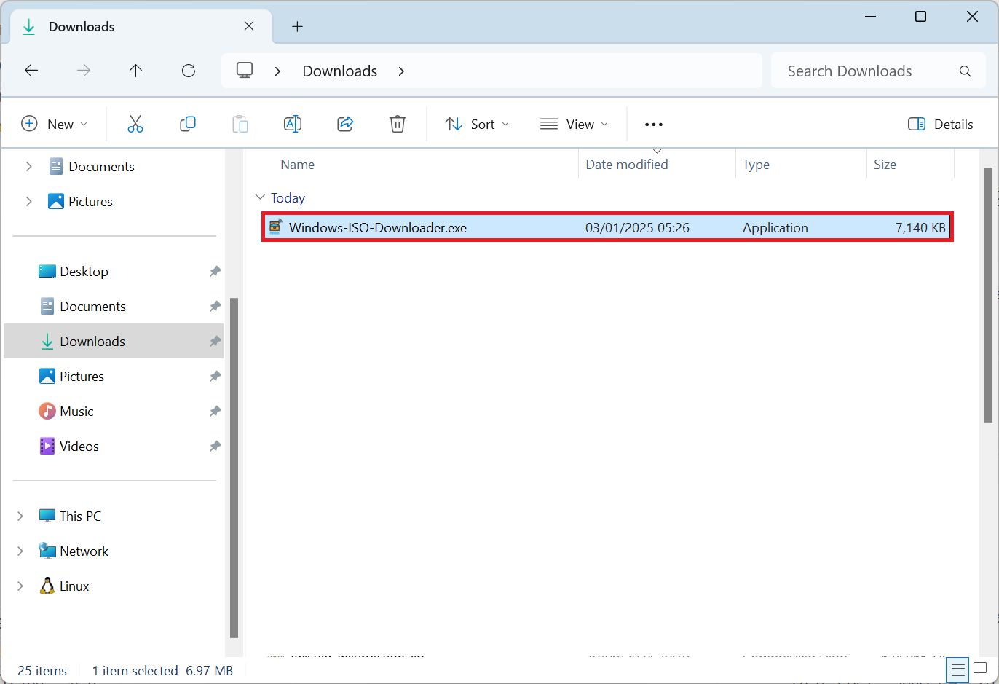
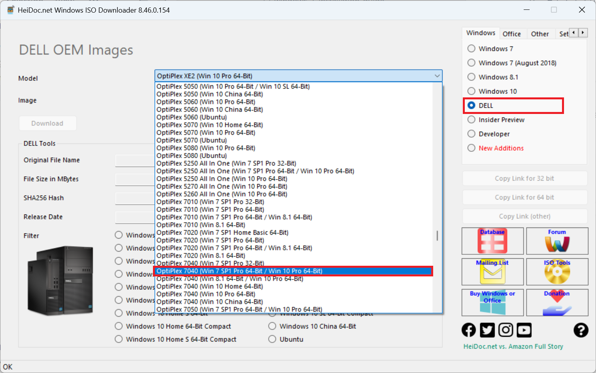

# Integrating Windows 7 Updates and Driver Pack using NTLite

## Utilities

Download and install the following utilities:

* [NTLite **2024.12.10221**](https://www.ntlite.com/download/)
* [7zip **Version 2409**](https://www.7-zip.org/)
* [Virtual Clone Drive **Version 5520**](https://www.elby.ch/en/products/vcd.html)
* [Rufus **Version 3.22**](https://rufus.ie/downloads/)

Rufus Version 3.22 is the last version to support Windows 7. The latest version of the other utilities supports Windows 7 but there is no guarantee newer versions will be tested with an end of life operating system.

## Windows ISO

Download and launch the Windows ISO Download Tool:

* [Windows ISO Download Tool](https://www.heidoc.net/joomla/technology-science/microsoft/67-microsoft-windows-and-office-iso-download-tool)



Select Dell and OptiPlex 7040:




## Preparing OS Updates

Download the following and save the following updates in a `os updates` folder:

* [KB2670838](https://www.catalog.update.microsoft.com/Search.aspx?q=KB2670838)
* [KB2729094](https://www.catalog.update.microsoft.com/Search.aspx?q=KB2729094)
* [KB2834140](https://www.catalog.update.microsoft.com/Search.aspx?q=KB2834140)
* [KB3125574](https://www.catalog.update.microsoft.com/Search.aspx?q=KB3125574)
* [KB4474419](https://www.catalog.update.microsoft.com/Search.aspx?q=KB4474419)
* [KB4490628](https://www.catalog.update.microsoft.com/Search.aspx?q=KB4490628)
* [KB4534310](https://www.catalog.update.microsoft.com/Search.aspx?q=KB4534310)
* [KB4536952](https://www.catalog.update.microsoft.com/Search.aspx?q=KB4536952)

Download IE11:

* [IE11 64 Bit](https://www.microsoft.com/en-us/download/details.aspx?id=41628)
* [IE11 32 Bit](https://www.microsoft.com/en-us/download/details.aspx?id=40907)

Extract the file with 7zip, this extracted .exe will be recognised as KB2841134.

## Driver Updates

Download the Dell Driver Pack or Lenovo Driver Pack from the following link:

* [Dell Family Drive Packs](https://www.dell.com/support/kbdoc/en-uk/000181936/dell-family-driver-packs-for-windows-7?msockid=3309923401c763c13d6b81e8007c62cb)
* [Lenovo System Center Configuration Manager](https://support.lenovo.com/gb/en/solutions/ht074984-microsoft-system-center-configuration-manager-sccm-and-microsoft-deployment-toolkit-mdt-package-index)

Extract these `.zip` files using Windows explorer. If the file is a `.exe`, launch the `.exe` and follow the instructions to extract. If the file is a `.cab` file, use 7zip to extract it.

If using a Home Model, there is no driver pack available, use a driver pack from a business device that has the same generation of processor as your home device. Alternatively use the drivers provided in: 

* [Gigabyte Windows USB Tool](https://drivers.softpedia.com/get/MOTHERBOARD/GIGABYTE/Gigabyte-GA-H110TN-rev-1-0-Windows-USB-Installation-Utility-B16-1102-1.shtml)

Extract the .zip file. The drivers of interest are in the `StorageControllers` and `USB` folders.

## Windows 7 Folder

Create a folder in downloads called Windows 7. Right click the installation ISO and select Mount. Copy the contents of the ISO to this Windows 7 folder.

## OEM SLP

Examine the windows7 folder. Navigate to the `sources` subfolder. The `ei.cfg` is used to select the edition of Windows 7 preinstalled and is `professional` by default. For a Retail License this can be deleted. For an OEM license it can be modified
in notepad, change `professional` to the desired edition.

<details>
<summary>Windows 7 Starter</summary>

```
[EditionID]
starter
[Channel]
OEM
[VL]
0
```

</details>

<details>
<summary>Windows 7 Home Basic</summary>

```text
[EditionID]
homebasic
[Channel]
OEM
[VL]
0
```

</details>

<details>
<summary>Windows 7 Home Premium</summary>

```text
[EditionID]
homepremium
[Channel]
OEM
[VL]
0
```

</details>

<details>
<summary>Windows 7 Professional</summary>

```text
[EditionID]
professional
[Channel]
OEM
[VL]
0
```

</details>

<details>
<summary>Windows 7 Ultimate</summary>

```text
[EditionID]
ultimate
[Channel]
OEM
[VL]
0
```

</details>

The `$OEM$` folder contains OEM branding and some scripts which perform OEM SLP. To convert to Retail media, delete the `$OEM$` folder. The `slp.cmd` script in `sources\$OEM$\$$\setup\scripts` deploys a Microsoft Security Certificate file with an OEM System Locked Preinstallation Key. The OEM SLP key is generic and all Dell systems shipped with Windows 7 Professional use the key displayed by default. 

The OEM SLP key differs for each Edition and each OEM. Update this key in accordance to the OEM and the Edition:

<details>
<summary>Dell</summary>

|Edition|SLP Key|
|---|---|
|Starter|36T88-RT7C6-R38TQ-RV8M9-WWTCY|
|Home Basic|36Q3Y-BBT84-MGJ3H-FT7VD-FG72J|
|Home Premium|6RBBT-F8VPQ-QCPVQ-KHRB8-RMV82|
|Professional|32KD2-K9CTF-M3DJT-4J3WC-733WD|
|Ultimate|342DG-6YJR8-X92GV-V7DCV-P4K27|

</details>

<details>
<summary>Lenovo/IBM</summary>

|Edition|SLP Key|
|---|---|
|Starter|273P4-GQ8V6-97YYM-9YTHF-DC2VP|
|Home Basic|22MFQ-HDH7V-RBV79-QMVK9-PTMXQ|
|Home Premium|27GBM-Y4QQC-JKHXW-D9W83-FJQKD|
|Professional|237XB-GDJ7B-MV8MH-98QJM-24367|
|Ultimate|6K2KY-BFH24-PJW6W-9GK29-TMPWP|

</details>

<details>
<summary>HP/Compaq</summary>

|Edition|SLP Key|
|---|---|
|Starter|DX8R9-BVCGB-PPKRR-8J7T4-TJHTH|
|Home Basic|MHFPT-8C8M2-V9488-FGM44-2C9T3|
|Home Premium|4FG99-BC3HD-73CQT-WMF7J-3Q6C9|
|Professional|74T2M-DKDBC-788W3-H689G-6P6GT|
|Ultimate|MHFPT-8C8M2-V9488-FGM44-2C9T3|

</details>

<details>
<summary>Acer, Gateway and Packard</summary>

|Edition|SLP Key|
|---|---|
|Starter|RDJXR-3M32B-FJT32-QMPGB-GCFF6|
|Home Basic|MB4HF-2Q8V3-W88WR-K7287-2H4CP|
|Home Premium|VQB3X-Q3KP8-WJ2H8-R6B6D-7QJB7|
|Professional|YKHFT-KW986-GK4PY-FDWYH-7TP9F|
|Ultimate|FJGCP-4DFJD-GJY49-VJBQ7-HYRR2|

</details>

<details>
<summary>ASUS</summary>

|Edition|SLP Key|
|---|---|
|Starter|6K6WB-X73TD-KG794-FJYHG-YCJVG|
|Home Basic|89G97-VYHYT-Y6G8H-PJXV6-77GQM|
|Home Premium|2QDBX-9T8HR-2QWT6-HCQXJ-9YQTR|
|Professional|2WCJK-R8B4Y-CWRF2-TRJKB-PV9HW|
|Ultimate|2Y4WT-DHTBF-Q6MMK-KYK6X-VKM6G|

</details>

<details>
<summary>Sony</summary>

|Edition|SLP Key|
|---|---|
|Starter|32J2V-TGQCY-9QJXP-Q3FVT-X8BQ7|
|Home Basic|YV7QQ-RCXQ9-KTBHC-YX3FG-FKRW8|
|Home Premium|H4JWX-WHKWT-VGV87-C7XPK-CGKHQ|
|Professional|H9M26-6BXJP-XXFCY-7BR4V-24X8J |
|Ultimate|YJJYR-666KV-8T4YH-KM9TB-4PY2W|

</details>

<details>
<summary>Toshiba</summary>

|Edition|SLP Key|
|---|---|
|Starter|TGBKB-9KBGJ-3Y3J6-K8M2F-J2HJQ|
|Home Basic|9H4FH-VD69Y-TGBD2-4PM4K-DRMMH|
|Home Premium|6B88K-KCCWY-4F8HK-M4P73-W8DQG|
|Professional|2V8P2-QKJWM-4THM3-74PDB-4P2KH|

</details>

<details>
<summary>Samsung</summary>

|Edition|SLP Key|
|---|---|
|Starter|PV9BD-YBRX6-CTMG6-CCMJY-X8XG7|
|Home Basic|2P6PB-G7YVY-W46VJ-BXJ36-PGGTG|
|Home Premium|CQBVJ-9J697-PWB9R-4K7W4-2BT4J|
|Professional|GMJQF-JC7VC-76HMH-M4RKY-V4HX6|
|Ultimate|49PB6-6BJ6Y-KHGCQ-7DDY6-TF7CD|

</details>

<details>
<summary>MSI</summary>

|Edition|SLP Key|
|---|---|
|Starter|2W4DJ-JFFJV-DMCPP-2C3X8-883DP|
|Home Premium|4G3GR-J6JDJ-D96PV-T9B9D-M8X2Q|

</details>

The `ie.bat` file found `sources\$OEM$\$$\system32\OEM` applies Dell OEM branding in Internet Explorer. This may be unwanted for a different OEM. Open up this file in notepad. Delete the content under `:defaults`. The file should look like:

```
:defaults

:CLEANUP
del /F /Q %systemroot%\system32\oem\TextAppend.vbs
del /F /Q %systemroot%\system32\oem\ie.bat
```

The `unattend.xml` found `sources\$OEM$\$$\setup\scripts` applies Dell OEM branding in System Properties.  This may be unwanted for a different OEM. Open this file in notepad and delete all the contents between the unattend xml header:

```html
<?xml version="1.0" encoding="utf-8" ?>
<unattend xmlns="urn:schemas-microsoft-com:unattend">
</unattend>
```

The `oobe.xml` found `sources\$OEM$\$$\system32\oobe` applies Dell OEM branding to the default User Profile. This may be unwanted for a different OEM. Open this file in notepad and delete all the contents between the FirstExperience xml header:

```html
<?xml version="1.0" encoding="utf-8" ?>
<FirstExperience>
</FirstExperience>
```

## Integrating Updates + Drivers with NTLite

### Add Image Directory 

Launch NTLite. To the top left select Add Image Directory.

Navigate to the Windows7 folder in downloads and select select folder.

### Loading Edition

The boot.wim on the Windows 7 ISO has been modified by Dell to include USB 3.0 Drivers and NVMe drivers which are required for the Windows preboot environment to boot from the USB flash drive and recognise the storage controller. No changes should be made to the boot.wim.

The install.wim has been modified by Dell to include USB 3.0 Drivers and NVMe drivers and although Dell list this ISO as model specific, no driver packs have been integrated.

Double click on the desired Windows 7 Edition. NTLite will mount the edition from the install.wim.

### Loading Updates

Select Updates, select folder and select the `os updates` folder.

Select folder again and select the folder of the extracted ie11 .exe.

### Loading Drivers

Select the drivers folder and select the `windows7` then `x64` folder of the extracted drivers folder. If using the extracted Gigabyte Windows USB Tool. Select the `StorageControllers` folder and then select the `USB` folder.

### Unattended

The Microsoft .Net Framework 4.7.2 and 4.8.0 cannot be integrated. However they can be silently installed before user account setup by selecting the Microsoft .Net Framework 4.7.2 and providing the flag `/q` and Microsoft .Net Framework 4.8.0 and providing the flag `/q`. `/q` means quiet.

### Create Installation ISO

In the Apply tab select Create Bootable USB.


## Create Bootable USB

Use Rufus to create a Bootable USB.


