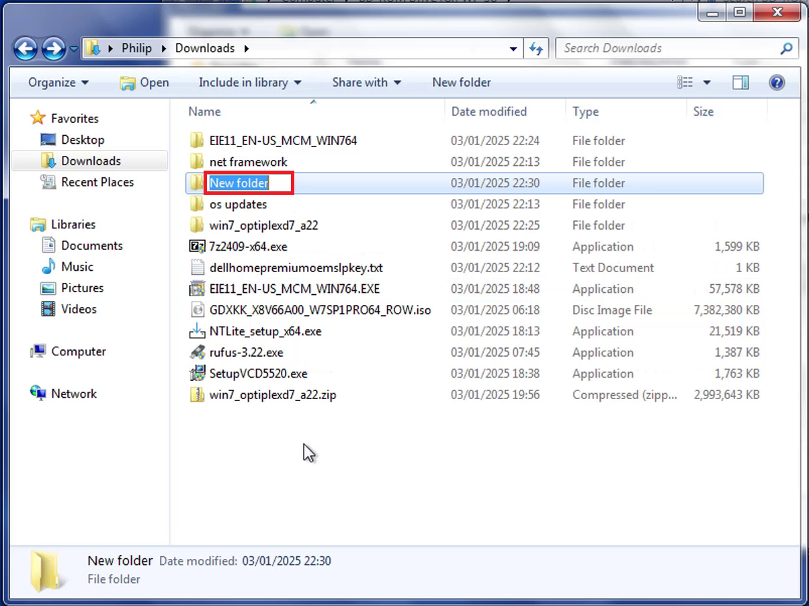
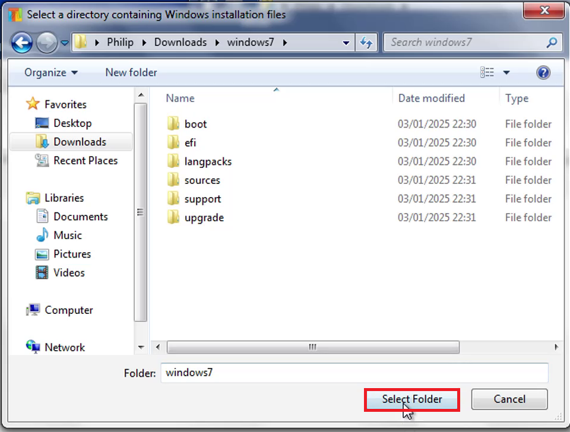
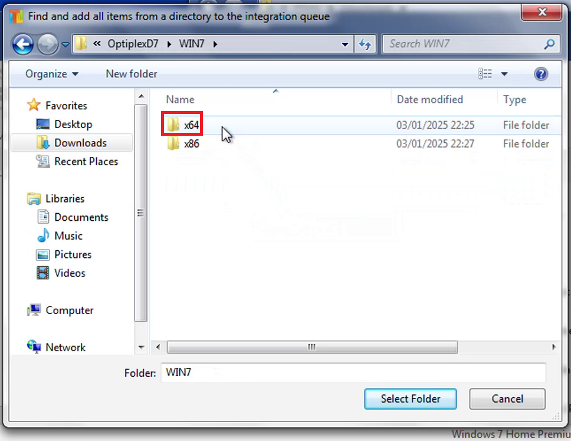
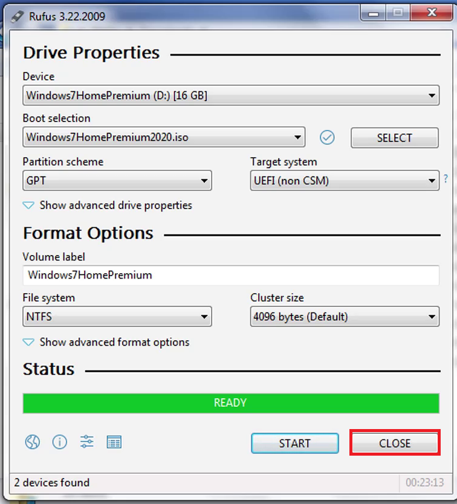

# Integrating Windows 7 Updates and Driver Pack using NTLite

## Utilities

Download and install the following utilities:

* [NTLite **2024.12.10221**](https://www.ntlite.com/download/)
* [7zip **Version 2409**](https://www.7-zip.org/)
* [Virtual Clone Drive **Version 5520**](https://www.elby.ch/en/products/vcd.html)
* [Rufus **Version 3.22**](https://rufus.ie/downloads/)

Rufus Version 3.22 is the last version to support Windows 7. The latest version of the other utilities supports Windows 7 but there is no guarantee newer versions will be tested with an end of life operating system.

## Windows ISO

Download and launch the Windows ISO Download Tool:

* [Windows ISO Download Tool](https://www.heidoc.net/joomla/technology-science/microsoft/67-microsoft-windows-and-office-iso-download-tool)


Select Dell and OptiPlex 7040:


Select Windows 7 64 Bit (or Windows 7 32 Bit) and select Download:


## Preparing OS Updates

Download the following and save the following updates in a `os updates` folder:

**Select the "Windows 7 64 Bit" Package for Windows 7 64 Bit or and "Windows 7" package for Windows 7 32 Bit.**

* [KB2670838](https://www.catalog.update.microsoft.com/Search.aspx?q=KB2670838)
* [KB2729094](https://www.catalog.update.microsoft.com/Search.aspx?q=KB2729094)
* [KB2834140](https://www.catalog.update.microsoft.com/Search.aspx?q=KB2834140)
* [KB3125574](https://www.catalog.update.microsoft.com/Search.aspx?q=KB3125574)
* [KB4474419](https://www.catalog.update.microsoft.com/Search.aspx?q=KB4474419)
* [KB4490628](https://www.catalog.update.microsoft.com/Search.aspx?q=KB4490628)
* [KB4534310](https://www.catalog.update.microsoft.com/Search.aspx?q=KB4534310)
* [KB4536952](https://www.catalog.update.microsoft.com/Search.aspx?q=KB4536952)


Download IE11:

* [IE11 64 Bit](https://www.microsoft.com/en-us/download/details.aspx?id=41628)
* [IE11 32 Bit](https://www.microsoft.com/en-us/download/details.aspx?id=40907)

To integrate this update it needs to be extracted:


Install 7zip:


Accept the User Account Control prompt:


Select Install:


Select Close:


Right click the `EIE11-EN-US_MCM_WIN7_64.exe` and select extract to...:


Navigate through to the extracted folder:


The extracted contents should look like:


## Driver Updates

Download the Dell Driver Pack or Lenovo Driver Pack from the following link:

* [Dell Family Driver Packs](https://www.dell.com/support/kbdoc/en-uk/000181936/dell-family-driver-packs-for-windows-7?msockid=3309923401c763c13d6b81e8007c62cb)
* [Lenovo System Center Configuration Manager](https://support.lenovo.com/gb/en/solutions/ht074984-microsoft-system-center-configuration-manager-sccm-and-microsoft-deployment-toolkit-mdt-package-index)

Extract these `.zip` files using Windows explorer. If the file is a `.exe`, launch the `.exe` and follow the instructions to extract. If the file is a `.cab` file, use 7zip to extract it.

<details>
<summary>If using a Home Device, such as an Inspiron, there is no driver pack available.</summary>

Use a driver pack from a Business Device such as a Latitude or OptiPlex that has the same generation of processor as your Home Device. Alternatively for only the USB 3.0 Controller and Storage Controller, the drivers incorporated in the Gigabyte Windows USB Tool can be used: 

* [Gigabyte Windows USB Tool](https://drivers.softpedia.com/get/MOTHERBOARD/GIGABYTE/Gigabyte-GA-H110TN-rev-1-0-Windows-USB-Installation-Utility-B16-1102-1.shtml)

Extract the .zip file. The drivers of interest are in the `StorageControllers` and `USB` folders.

</details>

In this example, the drivers are in the `.zip` format and can be extracted using Windows Explorer or 7zip. Select Extract All...:


Select extract:


Navigate through the extracted folder:


Select the Win7 folder:


Then the x64 folder for Windows 7 64 Bit. (Select the x86 folder for Windows 7 32 Bit):


The driver pack should resemble the following:


## Windows 7 Folder

Windows 7 does not have the native capability to mount an ISO. Install Virtual Clone Drive:


Accept the User Account Control prompt:


Select Agree:


Select Next:


Select Install:


Check Always Trust Elaborate Bytes AG and select Install:


Select Close:


Right click the ISO and select Mount:


Select Open to View Files:


Copy all of the Files:


In Downloads create a new folder and call it `windows7`:




Paste all the contents from the ISO. The install.wim is a very large file and may take a while to copy across:


## OEM SLP

It is recommended to change the folder options to show file extensions for known file types.

Navigate to the `sources` folder:


The `$OEM$` folder contains OEM branding and some scripts which perform OEM SLP. To convert to Retail media, delete the `$OEM$` folder. The `slp.cmd` script in `sources\$OEM$\$$\setup\scripts` deploys a Microsoft Security Certificate file with an OEM System Locked Preinstallation Key:


Right click the `SLP.cmd` file and select edit:


The OEM SLP key is generic and all Dell systems shipped with Windows 7 Professional use this key: 


The OEM SLP key differs for each Edition and each OEM. Update this key in accordance to the OEM and the Edition. In this example, a change to Dell Windows 7 Home Premium will be made:


For other Editions and other OEMs, see below:

<details>
<summary>Dell</summary>

|Edition|SLP Key|
|---|---|
|Starter|36T88-RT7C6-R38TQ-RV8M9-WWTCY|
|Home Basic|36Q3Y-BBT84-MGJ3H-FT7VD-FG72J|
|Home Premium|6RBBT-F8VPQ-QCPVQ-KHRB8-RMV82|
|Professional|32KD2-K9CTF-M3DJT-4J3WC-733WD|
|Ultimate|342DG-6YJR8-X92GV-V7DCV-P4K27|

</details>

<details>
<summary>Lenovo/IBM</summary>

|Edition|SLP Key|
|---|---|
|Starter|273P4-GQ8V6-97YYM-9YTHF-DC2VP|
|Home Basic|22MFQ-HDH7V-RBV79-QMVK9-PTMXQ|
|Home Premium|27GBM-Y4QQC-JKHXW-D9W83-FJQKD|
|Professional|237XB-GDJ7B-MV8MH-98QJM-24367|
|Ultimate|6K2KY-BFH24-PJW6W-9GK29-TMPWP|

</details>

<details>
<summary>HP/Compaq</summary>

|Edition|SLP Key|
|---|---|
|Starter|DX8R9-BVCGB-PPKRR-8J7T4-TJHTH|
|Home Basic|MHFPT-8C8M2-V9488-FGM44-2C9T3|
|Home Premium|4FG99-BC3HD-73CQT-WMF7J-3Q6C9|
|Professional|74T2M-DKDBC-788W3-H689G-6P6GT|
|Ultimate|MHFPT-8C8M2-V9488-FGM44-2C9T3|

</details>

<details>
<summary>Acer, Gateway and Packard</summary>

|Edition|SLP Key|
|---|---|
|Starter|RDJXR-3M32B-FJT32-QMPGB-GCFF6|
|Home Basic|MB4HF-2Q8V3-W88WR-K7287-2H4CP|
|Home Premium|VQB3X-Q3KP8-WJ2H8-R6B6D-7QJB7|
|Professional|YKHFT-KW986-GK4PY-FDWYH-7TP9F|
|Ultimate|FJGCP-4DFJD-GJY49-VJBQ7-HYRR2|

</details>

<details>
<summary>ASUS</summary>

|Edition|SLP Key|
|---|---|
|Starter|6K6WB-X73TD-KG794-FJYHG-YCJVG|
|Home Basic|89G97-VYHYT-Y6G8H-PJXV6-77GQM|
|Home Premium|2QDBX-9T8HR-2QWT6-HCQXJ-9YQTR|
|Professional|2WCJK-R8B4Y-CWRF2-TRJKB-PV9HW|
|Ultimate|2Y4WT-DHTBF-Q6MMK-KYK6X-VKM6G|

</details>

<details>
<summary>Sony</summary>

|Edition|SLP Key|
|---|---|
|Starter|32J2V-TGQCY-9QJXP-Q3FVT-X8BQ7|
|Home Basic|YV7QQ-RCXQ9-KTBHC-YX3FG-FKRW8|
|Home Premium|H4JWX-WHKWT-VGV87-C7XPK-CGKHQ|
|Professional|H9M26-6BXJP-XXFCY-7BR4V-24X8J |
|Ultimate|YJJYR-666KV-8T4YH-KM9TB-4PY2W|

</details>

<details>
<summary>Toshiba</summary>

|Edition|SLP Key|
|---|---|
|Starter|TGBKB-9KBGJ-3Y3J6-K8M2F-J2HJQ|
|Home Basic|9H4FH-VD69Y-TGBD2-4PM4K-DRMMH|
|Home Premium|6B88K-KCCWY-4F8HK-M4P73-W8DQG|
|Professional|2V8P2-QKJWM-4THM3-74PDB-4P2KH|

</details>

<details>
<summary>Samsung</summary>

|Edition|SLP Key|
|---|---|
|Starter|PV9BD-YBRX6-CTMG6-CCMJY-X8XG7|
|Home Basic|2P6PB-G7YVY-W46VJ-BXJ36-PGGTG|
|Home Premium|CQBVJ-9J697-PWB9R-4K7W4-2BT4J|
|Professional|GMJQF-JC7VC-76HMH-M4RKY-V4HX6|
|Ultimate|49PB6-6BJ6Y-KHGCQ-7DDY6-TF7CD|

</details>

<details>
<summary>MSI</summary>

|Edition|SLP Key|
|---|---|
|Starter|2W4DJ-JFFJV-DMCPP-2C3X8-883DP|
|Home Premium|4G3GR-J6JDJ-D96PV-T9B9D-M8X2Q|

</details>

Examine the windows7 folder. Navigate to the `sources` subfolder. The `ei.cfg` is used to select the edition of Windows 7 preinstalled and is `professional` by default. For a Retail License this can be deleted. For an OEM license it can be modified. Right click the `ei.cfg` file and select Open:


Select a Program from a List of Installed Programs and select OK:


Select notepad:


Change `professional` to the desired edition:


In this case `homepremium`:


Other editions are available:

<details>
<summary>Windows 7 Starter</summary>

```
[EditionID]
starter
[Channel]
OEM
[VL]
0
```

</details>

<details>
<summary>Windows 7 Home Basic</summary>

```text
[EditionID]
homebasic
[Channel]
OEM
[VL]
0
```

</details>

<details>
<summary>Windows 7 Home Premium</summary>

```text
[EditionID]
homepremium
[Channel]
OEM
[VL]
0
```

</details>

<details>
<summary>Windows 7 Professional</summary>

```text
[EditionID]
professional
[Channel]
OEM
[VL]
0
```

</details>

<details>
<summary>Windows 7 Ultimate</summary>

```text
[EditionID]
ultimate
[Channel]
OEM
[VL]
0
```

</details>

## OEM Branding

The `ie.bat` file found `sources\$OEM$\$$\system32\OEM` applies Dell OEM branding in Internet Explorer. This may be unwanted for a different OEM. Open up this file in notepad. Delete the content under `:defaults`. The file should look like:

```
:defaults

:CLEANUP
del /F /Q %systemroot%\system32\oem\TextAppend.vbs
del /F /Q %systemroot%\system32\oem\ie.bat
```

The `unattend.xml` found `sources\$OEM$\$$\setup\scripts` applies Dell OEM branding in System Properties.  This may be unwanted for a different OEM. Open this file in notepad and delete all the contents between the unattend xml header:

```html
<?xml version="1.0" encoding="utf-8" ?>
<unattend xmlns="urn:schemas-microsoft-com:unattend">
</unattend>
```

The `oobe.xml` found `sources\$OEM$\$$\system32\oobe` applies Dell OEM branding to the default User Profile. This may be unwanted for a different OEM. Open this file in notepad and delete all the contents between the FirstExperience xml header:

```html
<?xml version="1.0" encoding="utf-8" ?>
<FirstExperience>
</FirstExperience>
```

## Integrating Updates + Drivers with NTLite

### Installing NTLite

Install NTLite:


Accept the User Account Control prompt:


Select I Agree and then Next:


Select Next:


Select Next:


Select Launch NTLite and Finish:


Select Free and OK:


### Add Image Directory 

To the top left select Add Image Directory:


Navigate to the Windows7 folder in downloads:


Select select folder:



### Loading Edition

The boot.wim on the Windows 7 ISO has already been modified by Dell to include USB 3.0 Drivers and NVMe drivers which are required for the Windows preboot environment to boot from the USB flash drive and recognise the storage controller. No other changes should be made to the boot.wim.

Double click on the desired Windows 7 Edition. NTLite will mount the edition from the install.wim:


### Loading Updates

To the left select Updates. To the top hover over add and then select directory. Select the `os updates` folder:


To the top hover over add again and once again select directory. Select the `EIE11-EN-US_MCM_WIN7_64` folder:


Select OK at the warnings:


The IE11 Update displays (note this is integrated already in the Windows 7 Professional Edition):


### Loading Drivers

To the left select drivers. Then hover over add and select Directory:


Go to the extracted drivers folder:


Select the `x64` folder for Windows 7 64 Bit and the `x86` folder for Windows 7 32 Bit:



Select select folder:


There will be a warning about some drivers architecture. Some of the installers for the drivers have the 64 Bit and 32 Bit drivers grouped and thus there is a duplicate of the mixed architecture driver in the `x64` and `x86` folder. When the `x64` folder is selected, the 32 Bit drivers in it are of an incompatible architecture and are ignored. Select OK:


### Unattended

The Microsoft .Net Framework 4.7.2 and 4.8.0 are Windows applications and cannot be integrated as updates. They can however be configured to silently install before the user first logs in:


To the right hand side, select Post-Setup. To the top hover over before login and select file:


Select the net framework folder:


Select the Microsoft .NET Framework 4.7.2 standalone installer and select Open:


Under parameters providing the flag `/q`, `/q` means quietly install:


To the top once again hover over before login and select file:


Select the Microsoft .NET Framework 4.8.0 standalone installer and select Open:


Under parameters providing the flag `/q`:


### Create Installation ISO

To the right hand side select apply and to the left hand side check Create ISO:


Navigate to Downloads and call the ISO `Windows7Edition2020.iso`, in this case `Windows7HomePremium.iso` and then select Save:


Call the label `Windows7Edition` in this case `Windows7HomePremium` and select OK:


### Process

Select Process:


Select Yes:


Select OK:


Select OK:


The installation ISO has been created:


## Create a Bootable USB

Launch Rufus:


Accept the User Account Control Prompt:


Select the 16 GB USB Flash Drive and select select to select the ISO:


Select the `Windows7Edition.iso`, in this case the `Windows7HomePremium.iso` and select open:


For Windows 7 64 Bit and a UEFI BIOS, select GPT under the Partition Scheme. 

<details>
<summary>Windows 7 32 Bit or Legacy BIOS</summary>

If installing Windows 7 32 Bit or using a computer with a Legacy only BIOS. The MBR Partition Scheme should be used instead.

</details>

Select Start:


Select OK:


When finished, Rufus will say Ready, select Close:



The installation media is now ready. To install Windows 7 return to [Windows 7 Installation Guide: BIOS Setup](../readme.md#bios-setup).