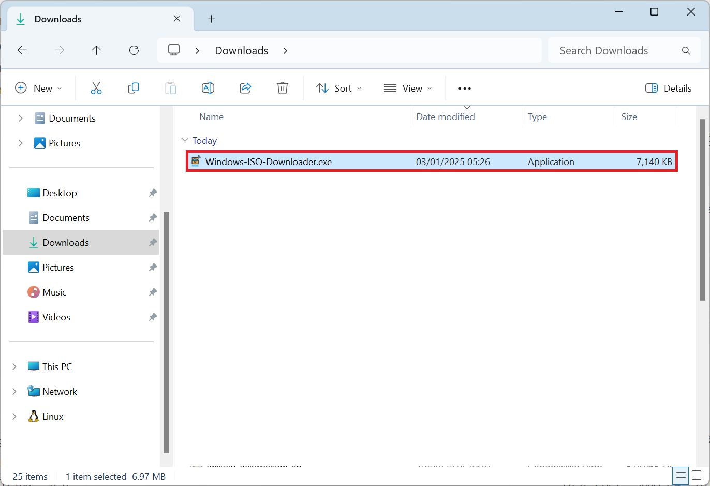
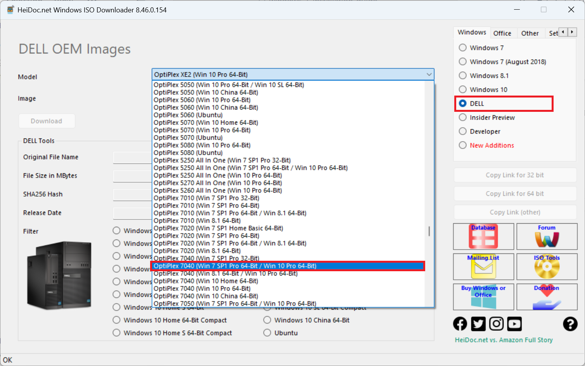

# Windows 7 Virtualisation

## Download Dell ISO

Download and launch the Windows ISO Download Tool:

* [Windows ISO Download Tool](https://www.heidoc.net/joomla/technology-science/microsoft/67-microsoft-windows-and-office-iso-download-tool)



Select Dell and OptiPlex 7040:



Select Windows 7 64 Bit (or Windows 7 32 Bit) and select Download:


## Windows HyperVisor Platform

Add/Remove Features.

## Installing VMware Workstation

Download the latest version of VMware Workstation from VMware:

* [VMware Workstation](https://softwareupdate.vmware.com/cds/vmw-desktop/ws/)


## Creating a Windows 7 VM


## SLIC Passthrough and OEM SLP

Add the following to your VMware configuration file:

```
firmware = "efi"
acpi.passthru.slic = "TRUE"
acpi.passthru.slicvendor = "TRUE"
SMBIOS.reflecthost = "TRUE"
```

Do not add the first line for Windows 7 32 Bit. For 64 Bit add the first line but check for the line:

```
firmware = "bios"
```
