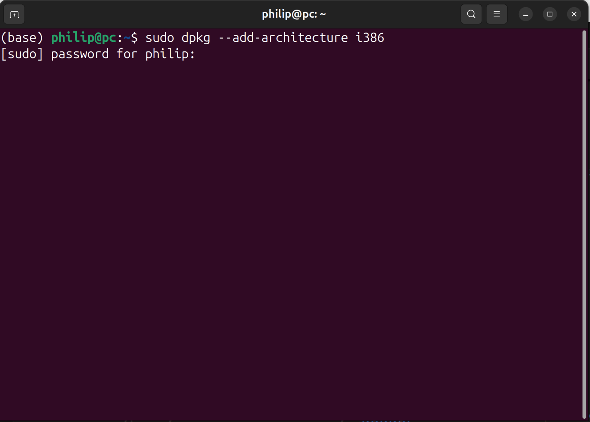
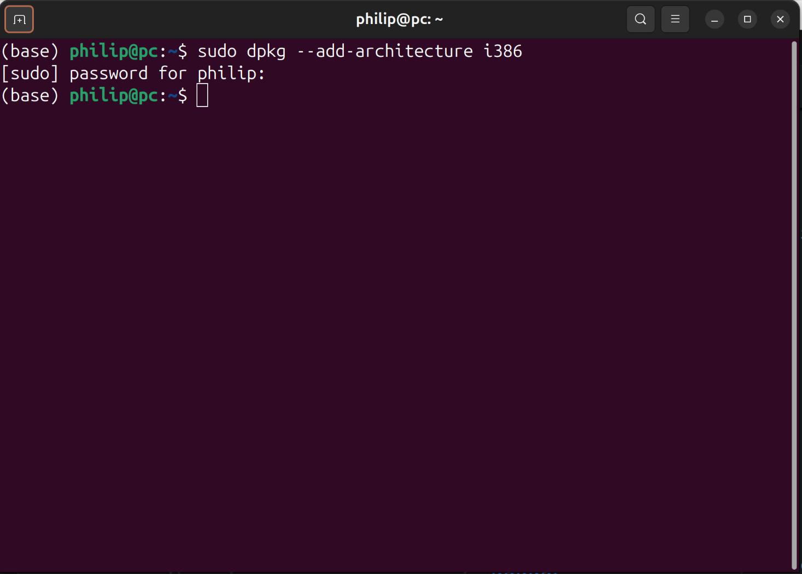
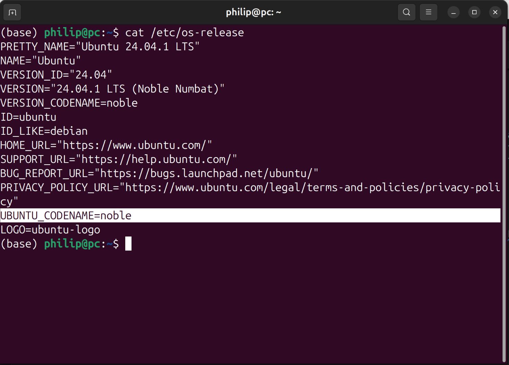

## Download the Windows ISO Download Tool:

The Windows ISO Download Tool is a Windows Application:

* [Windows ISO Download Tool](https://www.heidoc.net/joomla/technology-science/microsoft/67-microsoft-windows-and-office-iso-download-tool)

## Wine

Open up the Terminal to add the 32 Bit architecture input:

```bash
sudo dpkg --add-architecture i386
```

The following will display Note that `sudo` means super user do and an authentication prompt will display. Input your password to continue:



This will display a new prompt:



To create the directory `keyrings`use:

```bash
sudo mkdir -pm755 /etc/apt/keyrings
```

Note that this is a system wide directory found under `/etc/apt`. Because this is a system wide directory `sudo` is required to run the command make directory `mkdir`. `-p` is an instruction to create the parent directories if required. `-m755` sets permissions `7` (read, write, and execute for the duper user), `5` (read and execute for the group of the user), `5` (read and execute for others).

The wine repository key can be added to this keyring:

```bash
sudo wget "https://dl.winehq.org/wine-builds/winehq.key" -O /etc/apt/keyrings/winehq-archive.key
```

`wget` is a command line tool which is used to download a file from a URL. `-O` is an instruction to output the key to the file `/etc/apt/keyrings/winehq-archive.key`. 

wine has Ubuntu version specific repositories. To check the Ubuntu version use:

```bash
cat /etc/os-release
```

The terminal will display something like: 



In this example the `UBUNTU_CODENAME` in this case is `noble` (Ubuntu 24.04 LTS).

Add only the repository which matches the `UBUNTU_CODENAME`:

<details>
<summary>Ubuntu 24.04 VERSION_CODENAME=noble</summary>

```bash
sudo wget -NP /etc/apt/sources.list.d/ https://dl.winehq.org/wine-builds/ubuntu/dists/noble/winehq-noble.sources
```

</details>


<details>
<summary>Ubuntu 24.10 VERSION_CODENAME=oracular</summary>

```bash
sudo wget -NP /etc/apt/sources.list.d/ https://dl.winehq.org/wine-builds/ubuntu/dists/oracular/winehq-oracular.sources
```

</details>

To update the repositories used by `apt` use:

```bash
sudo apt update
```

To install wine use:

```bash
sudo apt install wine wine32 wine64 libwine fonts-wine winetricks playonlinux
```

The package `wine` allows Windows applications to run on Ubuntu. `wine32` allows Windows 32 Bit applications to run on 64 Bit Ubuntu. `wine64` allows Windows 64 Bit applications to run on 64 Bit Ubuntu.

The package `libwine` is a core dependency of `wine`. The package `fonts-wine` is required for proper font rendering.

`wine-mono` is a .NET Framework replacement for wine:

```bash
wget "https://dl.winehq.org/wine/wine-mono/9.4.0/wine-mono-9.4.0-x86.msi"
```

```bash
wine start wine-mono-9.4.0-x86.msi
```

`wine-gecko` is a replacement for Internet Explorer for wine:

```bash
wget "https://dl.winehq.org/wine/wine-gecko/2.47.4/wine-gecko-2.47.4-x86_64.msi"
```

```bash
wine start wine-gecko-2.47.4-x86_64.msi
```

## Windows ISO Download Tool

To download the Windows ISO Tool use:


```bash
wget "https://www.heidoc.net/php/Windows-ISO-Downloader.exe"
```

To launch it using wine use:

```bash
wine start Windows-ISO-Downloader.exe
```

## Installing VMware Workstation

```
sudo apt install build-essential
```


```
https://itsfoss.com/install-vmware-player-ubuntu-1310/
```


Download the latest version of VMware Workstation from VMware:

* [VMware Workstation](https://softwareupdate.vmware.com/cds/vmw-desktop/ws/)


